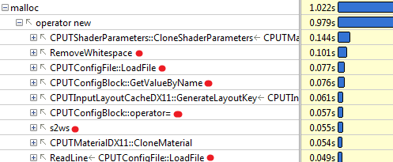
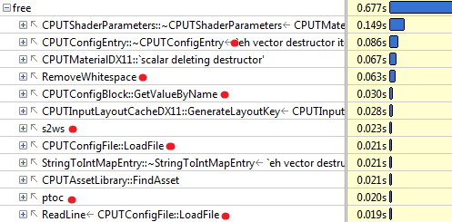

-title=A string processing rant
-time=2013-01-30 11:40:12
*This post is part of a series \- go [here](*optimizing-sw-occlusion-culling-index) for the index.*

Rants are not usually the style of this blog, but this one I just don't want to keep in. So if you're curious, the actual information content of this post will be as follows: C string handling functions kinda suck. So does C\+\+'s `std::string`. Dealing with wide character strings using only standard C/C\+\+ functionality is absolutely horrible. And VC\+\+'s implementation of said functionality is a damn minefield. That's it. You will not actually learn anything more from reading this post. Continue at your own risk.

**UPDATE**: As "cmf" points out in the comments, there are actually C\+\+ functions that seem to do what I wanted in the first place with a minimum amount of fuss. Goes to show, the one time I post a rant on this blog and of course I'm wrong! :\) That said, I do stand by my criticism of the numerous API flaws I point out in this post, and as I point out in myreply, the discoverability of this solution is astonishingly low; when I ran into this problem originally, not being familiar with `std::wstring` I googled a bit and checked out Stack Overflow and several other coding sites and mailing list archives, and what appears to be the right solution showed up on none of the pages I ran into. So at the very least I'm not alone. Ah well.

### The backstory

I spent most of last weekend playing around with [my fork](https://github.com/rygorous/intel_occlusion_cull) of [Intel's Software Occlusion Culling](http://software.intel.com/en-us/vcsource/samples/software-occlusion-culling) sample. I was trying to optimize some of the hot spots, a process that involves a lot of small \(or sometimes not\-so\-small\) modifications to the code followed by a profiling run to see if they help. Now unfortunately this program, at least in its original version, had loading times of around 24 seconds on my machine, and having to wait for those 24 seconds every time before you can even start the profiling run \(which takes another 10\-20 seconds if you want useful results\) gets old *fast*, so I decided to check whether there was a simple way to shorten the load times.

Since I already had the profiler set up, I decided to take a peek into the loading phase. The first big time\-waste I found was a texture loader that was unnecessarily decompressing a larger DXT skybox texture, and then recompressing it again. I won't go into details here; suffice it to say that once I had identified the problem, it was straightforward enough to fix, and it cut down loading time to about 12 seconds.

My next profiling run showed me this:


I've put a red dot next to functions that are called either directly or indirectly by the configuration\-file class `CPUTConfigFile`. Makes you wonder, doesn't it? Lest you think I'm exaggerating, here's some of the call stacks for our \#2 function, `malloc`:



Here's the callers to \#5, `free`:



And here's `memcpy`, further down:


I have to say, I've done optimization work on lots of projects over the years, and it's rare that you'll see a single piece of functionality leave a path of destruction *this* massive in its wake. The usual patterns you'll see are either "localized performance hog" \(a few functions completely dominating the profile, like I saw in the first round with the texture loading\) or the "death by a thousand paper cuts", where the profile is dominated by lots of "middle\-man" functions that let someone else do the actual work but add a little overhead each time. As you can see, that's not what's going on here. What we have here is the rare "death in all directions" variant. Why settle for paper cuts, just go straight for the damn cluster bomb!

At this point it was clear that the whole config file thing needed some serious work. But first, I was curious. Config file loading and config block handling, sure. But what was that `RemoveWhitespace` function doing there? So I took a look.

### How not to remove whitespace

Let's cut straight to the chase: Here's the code.

```
void RemoveWhitespace(cString &szString)
{
    // Remove leading whitespace
    size_t nFirstIndex = szString.find_first_not_of(_L(' '));
    if(nFirstIndex != cString::npos)
    {
        szString = szString.substr(nFirstIndex);
    }

    // Remove trailing newlines
    size_t nLastIndex = szString.find_last_not_of(_L('\n'));
    while(nLastIndex != szString.length()-1)
    {
        szString.erase(nLastIndex+1,1);
        nLastIndex = szString.find_last_not_of(_L('\n'));
    };
    // Tabs
    nLastIndex = szString.find_last_not_of(_L('\t'));
    while(nLastIndex != szString.length()-1)
    {
        szString.erase(nLastIndex+1,1);
        nLastIndex = szString.find_last_not_of(_L('\t'));
    };
    // Spaces
    nLastIndex = szString.find_last_not_of(_L(' '));
    while(nLastIndex != szString.length()-1)
    {
        szString.erase(nLastIndex+1,1);
        nLastIndex = szString.find_last_not_of(_L(' '));
    };
}
```

As my current and former co\-workers will confirm, I'm generally a fairly calm, relaxed person. However, in moments of extreme frustration, I will \(on occasion\) perform a "\*headdesk\*", and do so properly.

This code did not drive me quite that far, but it was a close call.

Among the many things this function does wrong are:

* While it's supposed to strip all leading and trailing white space \(not obvious from the function itself, but clear in context\), it will only trim leading spaces. So for example leading tabs won't get stripped, nor will any spaces that follow after those tabs.
* The function will remove trailing spaces, tabs, and newlines \- provided they occur in exactly that order: first all spaces, then all tabs, then all newlines. But the string "test\\t \\n" will get trimmed to "test\\t" with the tab still intact, because the tab\-stripping loop will only tabs that occur at the end of the string after the newlines have been removed.
* It removes white space characters it finds front to back rather than back to front. Because of the way C/C\+\+ strings work, this is an O\(N<sup>2</sup>\) operation. For example, take a string consisting only of tabs.
* The substring operation creates an extra temporary string; while not horrible by the standards of what else happens in this function, it's now becoming clear why `RemoveWhitespace` manages to feature prominently in the call stacks for `malloc`, `free` and `memcpy` at the same time.
* And let's not even talk about how many times the string is scanned from front to back.

That by itself would be bad enough. But it turns out that in context, not only is this function badly implemented, most of the work it does is completely unnecessary. Here's one of its main callers, `ReadLine`:

```
CPUTResult ReadLine(cString &szString, FILE *pFile)
{
    // TODO: 128 chars is a narrow line.  Why the limit?
    // Is this not really reading a line, but instead just reading the next 128 chars to parse?
    TCHAR   szCurrLine[128] = {0};
    TCHAR *ret = fgetws(szCurrLine, 128, pFile);
    if(ret != szCurrLine)
    {
        if(!feof(pFile))
        {
            return CPUT_ERROR_FILE_ERROR;
        }
    }

    szString = szCurrLine;
    RemoveWhitespace(szString);

    // TODO: why are we checking feof twice in this loop?
    // And, why are we using an error code to signify done?
    // eof check should be performed outside ReadLine()
    if(feof(pFile))
    {
        return CPUT_ERROR_FILE_ERROR;
    }

    return CPUT_SUCCESS;
}
```

I'll let the awesome comments speak for themselves \- and for the record, no, this thing really is supposed to read a line, and the ad\-hoc parser that comes after this will get out of sync if it's ever fed a line with more than 128 characters in it.

But the main thing of note here is that `szString` is assigned from a C\-style \(wide\) string. So the sequence of operations here is that we'll first allocate a `cString` \(which is a typedef for a `std::wstring`, by the way\), copy the line we read into it, then call `RemoveWhitespace` which might create another temporary string in the `substr` call, to follow it up with several full\-string scans and possibly memory moves.

Except all of this is completely unnecessary. Even if we need the output to be a `cString`, we can just start out with a subset of the C string to begin with, rather than taking the whole thing. All `RemoveWhitespace` really needs to do is tell us where the non\-whitespace part of the string begins and ends. You can either do this using C\-style string handling or, if you want it to "feel more C\+\+", you can express it by iterator manipulation:

```
static bool iswhite(int ch)
{
    return ch == _L(' ') || ch == _L('\t') || ch == _L('\n');
}

template
static void RemoveWhitespace(Iter& start, Iter& end)
{
    while (start < end && iswhite(*start))
        ++start;

    while (end > start && iswhite(*(end - 1)))
        --end;
}
```

Note that this is not only much shorter, it also correctly deals with all types of white space both at the beginning and the end of the line. Instead of the original string assignment we then do:

```
    // TCHAR* obeys the iterator interface, so...
    TCHAR* start = szCurrLine;
    TCHAR* end = szCurrLine + tcslen(szCurrLine);
    RemoveWhitespace(start, end);
    szString.assign(start, end);
```

Note how I use the iterator range form of `assign` to set up the string with a single copy. No more substring operations, no more temporaries or O\(N<sup>2</sup>\) loops, and after reading we scan over the entire string no more than two times, one of those being in `tcslen`. \(`tcslen` is a MS extension that is the equivalent of `strlen` for `TCHAR` \- which might be either plain `char` or `wchar_t`, depending on whether `UNICODE` is defined \- this code happens to be using "Unicode", that is, UTF\-16\).

There's only two other calls to `RemoveWhitespace`, and both of these are along the same vein as the call we just saw, so they're just as easy to fix up.

### Problem solved?

Not quite. Even with the `RemoveWhitespace` insanity under control, we're still reading several megabytes worth of text files with short lines, and there's still between 1 and 3 temporary string allocations per line in the code, plus whatever allocations are needed to actually store the data in its final location in the `CPUTConfigBlock`.

Long story short, this code still badly needed to be rewritten to do less string handling, so I did. My new code just reads the file into a memory buffer in one go \(the app in question takes 1.5GB of memory in its original form, we can afford to allocate 650K for a text file in one block\) and then implements a more reasonable scanner that processes the data in place and doesn't do any string operations until we need to store values in their final location. Now, because the new scanner assumes that ASCII characters end up as ASCII, this will actually not work correctly with some character encodings such as Shift\-JIS, where ASCII\-looking characters can appear in the middle of encodings for multibyte characters \(the config file format mirrors INI files, so '\[', '\]' and '=' are special characters, and the square brackets can appear as second characters in a Shift\-JIS sequence\). It does however still work with US\-ASCII text, the ISO Latin family and UTF\-8, which I decided was acceptable for a config file reader. I did still want to support Unicode characters as identifiers though, which meant I was faced with a problem: once I've identified all the tokens and their extents in the file, surely it shouldn't be hard to turn the corresponding byte sequences into the `std::wstring` objects the rest of the code wants using standard C\+\+ facilities? Really, all I need is a function with this signature:

```
void AssignStr(cString& str, const char* begin, const char* end);
```

### Converting strings, how hard can it be?

Turns out: quite hard. I could try using `assign` on my `cString` again. That "works", if the input happens to be ASCII only. But it just turns each byte value into the corresponding Unicode code point, which is blatantly wrong if our input text file actually has any non\-ASCII characters in it.

Okay, so we could turn our character sequence into a `std::string`, and then convert that into a `std::wstring`, never mind the temporaries for now, we can figure that out later... wait, WHAT? There's actually no official way to turn a `string` containing multi\-byte characters into a `wstring`? How moronic is that?

Okay, whatever. Screw C\+\+. Just stick with C. Now there actually *is* a standard function to convert multi\-byte encodings to `wchar_t` strings, and it's called, in the usual "omit needless vowels" C style, `mbstowcs`. Only that function *can't be used* on an input string that's delimited by two pointers! Because while it accepts a size for the *output* buffer, it assumes the *input* is a 0\-terminated C string. Which may be a reasonable protocol for most C string\-handling functions, but is definitely problematic for something that's typically used for input parsing, where you generally aren't guaranteed to have NUL characters in the right places.

But let's assume for a second that we're willing to modify the input data \(`const` be damned\) and temporarily overwrite whatever is at `end` with a NUL character so we can use `mbstowcs` \- and let me just remark at this point that awesomely, the Microsoft\-extended safe version of `mbstowcs`, `mbstowcs_s`, accepts *two* arguments for the size of the output buffer, but still doesn't have a way to control how many input characters to read \- if you decide to extend a standard API anyway, why can't you fix it at the same time? Anyway, if we just patch around in the source string to make `mbstowcs` happy, does that help us?

Well, it depends on how loose you're willing to play with the C\+\+ standard. The goal of the whole operation was to reduce the number of temporary allocations. Well, `mbstowcs` wants a `wchar_t` output buffer, and writes it like it's a C string, including terminating NUL. `std::wstring` also has memory allocated, and normal implementations will store a terminating 0 `wchar_t`, but as far as I can tell, this is not actually guaranteed. In any case, there's a problem, because we need to reserve the right number of wchar's in the output string, but it's not guaranteed to be safe to do this:

```
void AssignStr(cString& str, const char* begin, const char* end)
{
    // patch a terminating NUL into *end
    char* endPatch = (char*) end;
    char oldEnd = *end;
    *endPatch = 0;

    // mbstowcs with NULL arg counts how many wchar_t's would be
    // generated
    size_t numOut = mbstowcs(NULL, begin, 0);

    // make sure str has the right size
    str.resize(numOut, ' ');

    // convert characters including terminating NUL and hope it's
    // going to be OK?
    mbstowcs(&str[0], begin, numOut + 1);

    // restore the original end
    *endPatch = oldEnd;
}
```

This might work, or it might not. As far as I know, it would be legal for a `std::wstring` implementation to only append a trailing NUL character lazily whenever `c_str()` is first called on a particular string. Either way, it's fairly gross. I suppose I could `resize` to `numOut + 1` elements, and then later do another resize after the `mbstowcs` is done; that way should definitely be safe.

Either way is completely beside the point though. This is an actual, nontrivial operation on strings that is a totally reasonable thing to do, and that the C IO system will in fact do for me implicitly if I use `fgetws`. *Why are all the functions dealing with this so horribly broken for this use case that's not at all fancy?* Did anyone ever look at this and decide that it was reasonable to expect people to write code like this? WHAT THE HELL?

### It gets better

That's not it quite yet, though. Because when I actually wrote the code \(as opposed to summarizing it for this blog post\), I didn't think to patch in the NUL byte on the source string. So I went for the alternative API that works character by character: the C function `mbtowc`. Now, awesomely, because it works character by character, and is not guaranteed to see all characters in a multi\-byte sequence in the same call, it has to keep state around of which partial multi\-byte sequences it has seen to be able to decode characters. So it's not thread\-safe, and POSIX defines an extended version `mbrtowc` that makes you pass in a pointer to that state which does make it thread\-safe. At this point though, I don't care about thread\-safety \(this code is single\-threaded anyway\), and besides, in our case I actually know that the characters between `begin` and `end` are supposed to parse correctly. So I just don't worry about it. Also, instead of actually counting the right number of `wchar_t`'s ahead of time in a second pass, I just assume that the string is generally likely to have less wide characters than the source multi\-byte string has bytes. Even if that turns out wrong \(which won't happen for conventional encodings\), the `std::wstring` we write to can dynamically resize, so there's not much that can go wrong. So I ended up with this implementation:

```
void AssignStr(cString& dest, const char* begin, const char* end)
{
    dest.clear();
    if (end <= begin)
        return;

    size_t len = end - begin;
    size_t initial = len + 1; // assume most characters are 1-byte
    dest.reserve(initial);

    const char* p = start;
    while (p < end)
    {
        wchar_t wc;
        int len = mbtowc(&wc, p, end - p);
        if (len < 1) // NUL byte or error
            break;

        p += len;
        dest.push_back(wc);
    }
}
```

Looks fairly reasonable, right?

Well, one profiling session later, I noticed that performance had improved, but it turned out that I was apparently wrong to assume that, like its `std::vector` counterpart, `std::wstring::push_back` would basically compile into the moral equivalent of `dest.data[dest.len++] = wc`. Instead, what I saw in VTune \(with a kind of morbid fascination\) was about two dozen instructions worth of inlined insanity surrounding a call to `std::wstring::insert`. *For every character*. **In a release build**.

It's probably the VC\+\+ STL doing something stupid. At this point, I don't feel like investigating why this is happening. Whatever, I'm just gonna add some more to this layer cake of insanity. Just stop thinking and start coding. So I figure that hey, if adding stuff to strings is apparently an expensive operation, well, let's amortize it, eh? So I go for this:

```
void AssignStr(cString& dest, const char* begin, const char* end)
{
    dest.clear();
    if (end <= begin)
        return;

    static const int NBUF = 64;
    wchar_t buf[NBUF];
    int nb = 0;

    size_t len = end - begin;
    size_t initial = len + 1; // assume most characters are 1-byte
    dest.reserve(initial);

    const char* p = start;
    while (p < end)
    {
        int len = mbtowc(&buf[nb++], p, end - p);
        if (len < 1) // NUL byte or error
            break;

        p += len;
        if (p >= end || nb >= NBUF)
        {
            dest.append(buf, buf + nb);
            nb = 0;
        }
    }
}
```

And it's *still* slow, and I *still* get a metric ton of bullshit inlined for that call. Turns out this happens because I call the general "input iterator" variant of `append` which, go figure, adds character by character. Silly me! What I really should've called is `dest.append(buf, nb)`. Of course! Once I figure that one out, I profile again, and sure enough, this time there's no magic `std::string` functions cluttering up the profile anymore. Finally. Mission accomplished, right?

### Not so fast, bucko.

Ohhh no. No, there's one final "surprise" waiting for me. I put surprise in quotes because we already saw it in my first profile screenshot.


Yeah right. Those C functions we've been calling? In the VC\+\+ C runtime library, all of them end up calling a constructor for a C\+\+ object for some reason.

No, I'm not gonna comment on that one. I stopped caring a few paragraphs ago. Go ahead, put C\+\+ code in your C runtime library. Whatever makes you happy.

So it turns out that VC\+\+ has two versions of all the multibyte conversion functions: one that uses the current locale \(which you can query using `_get_current_locale()`\) and one that takes an explicit `locale_t` parameter. And if you don't pass in a locale yourself, `mbtowc` and so forth will call `_get_current_locale()` themselves, and that ends up calling a C\+\+ constructor for some reason. \(I don't care, I'm in my happy place right now. La la la\).

And I finally decide to screw portability \- hey, it's a VC\+\+\-only project anyway \- and call `_get_current_locale()` once, pass it to all my calls, and the magic constructor disappears, and with it the last sign of dubious things happening in the string handling.

Hooray.

### Conclusions

So, what do we have here: we have a C\+\+ string class that evidently makes it easy to write horrendously broken code without noticing it, and simultaneously doesn't provide some core functionality that apps which use both `std::wstring` *and* interface with non\-UTF16 character sets \(which is almost nobody, I'm sure!\) will need. We have C functions that go out of their way to make it hard to use them correctly. We have the Microsoft camp that decides that the right way to fix these functions is to fix buffer overflows, and we have the POSIX camp that decides that the right way to fix them is to fix the race condition inherent in their global state. Both of these claim that their modifications are more important than the other's, and then there's the faction that holds the original C standard library to be the only true way, ignoring the fact that this API is clearly *horribly broken* no matter how you slice it. Meanwhile, `std::wstring` gets another attention fix by making it unnecessarily hard to actually get data from C APIs into it without extra copying \(and may I remind you that I'm only using C APIs here because there doesn't seem to be an official C\+\+ API!\), while the VC\+\+ standard library proves its attention deficit by somehow making a `push_back` to a properly pre\-allocated string an expensive operation. And for the final act of our little performance, watch as a constructor gets called from C code, a veritable Deus Ex Machina that I honestly didn't see coming.

As my friend Casey Muratori would put it: **Everyone is fired.**

And now excuse me while I apply some bandages and clean the blood off my desk.