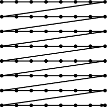
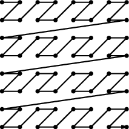

-title=Depth buffers done quick, part 1
-time=2013-02-11 11:18:26
*This post is part of a series \- go [here](*optimizing-sw-occlusion-culling-index) for the index.*

Welcome back to yet another post on my series about Intel's [Software Occlusion Culling](http://software.intel.com/en-us/vcsource/samples/software-occlusion-culling) demo. The past few posts were about triangle rasterization in general; at the end of the previous post, we saw how the techniques we've been discussing are actually implemented in the code. This time, we're going to make it run faster \- no further delays.

### Step 0: Repeatable test setup

But before we change anything, let's first set up repeatable testing conditions. What I've been doing for the previous profiles is start the program from VTune with sample collection paused, manually resume collection once loading is done, then manually exit the demo after about 20 seconds without moving the camera from the starting position.

That was good enough while we were basically just looking for unexpected hot spots that we could speed up massively with relatively little effort. For this round of changes, we expect less drastic differences between variants, so I added code that performs a repeatable testing protocol:

1. Load the scene as before.
2. Render 60 frames without measuring performance to allow everything to settle a bit. Graphics drivers tend to perform some initialization work \(such as driver\-side shader compilation\) lazily, so the first few frames with any given data set tend to be spiky.
3. Tell the profiler to start collecting samples.
4. Render 600 frames.
5. Tell the profile to stop collecting samples.
6. Exit the program.

The sample already times how much time is spent in rendering the depth buffer and in the occlusion culling \(which is another rasterizer that Z\-tests a bounding box against the depth buffer prepared in the first step\). I also log these measurements and print out some summary statistics at the end of the run. For both the rendering time and the occlusion test time, I print out the minimum, 25th percentile, median, 75th percentile and maximum of all observed values, together with the mean and standard deviation. This should give us a good idea of how these values are distributed. Here's a first run:

```

Render time:
  min=3.400ms  25th=3.442ms  med=3.459ms  75th=3.473ms  max=3.545ms
  mean=3.459ms sdev=0.024ms
Test time:
  min=1.653ms  25th=1.875ms  med=1.964ms  75th=2.036ms  max=2.220ms
  mean=1.957ms sdev=0.108ms
```

and here's a second run on the same code \(and needless to say, the same machine\) to test how repeatable these results are:

```
Render time:
  min=3.367ms  25th=3.420ms  med=3.432ms  75th=3.445ms  max=3.512ms
  mean=3.433ms sdev=0.021ms
Test time:
  min=1.586ms  25th=1.870ms  med=1.958ms  75th=2.025ms  max=2.211ms
  mean=1.941ms sdev=0.119ms
```

As you can see, the two runs are within about 1% of each other for all the measurements \- good enough for our purposes, at least right now. Also, the distribution appears to be reasonably smooth, with the caveat that the depth testing times tend to be fairly noisy. I'll give you the updated timings after every significant change so we can see how the speed evolves over time. And by the way, just to make that clear, this business of taking a few hundred samples and eyeballing the order statistics is most definitely *not* a statistically sound methodology. It happens to work out in our case because we have a nice repeatable test and will only be interested in fairly strong effects. But you need to be careful about how you measure and compare performance results in more general settings. That's a topic for another time, though.

Now, to make it a bit more readable as I add more observations, I'll present the results in a table as follows: \(this is the render time\)

<table>
  <tbody><tr>
    <th>Version</th>
    <th>min</th><th>25th</th><th>med</th><th>75th</th><th>max</th><th>mean</th><th>sdev</th>
  </tr>
  <tr>
    <td>Initial</td>
    <td>3.367</td><td>3.420</td><td>3.432</td><td>3.445</td><td>3.512</td><td>3.433</td><td>0.021</td>
  </tr>
</tbody></table>

I won't bother with the test time here \(even though the initial version of this post did\) because the code doesn't get changed; it's all noise.

### Step 1: Get rid of special cases

Now, if you followed the links to the code I posted last time, you might've noticed that the code checks the variable `gVisualizeDepthBuffer` multiple times, even in the inner loop. An example is [this passage](https://github.com/rygorous/intel_occlusion_cull/blob/97eae9a8/SoftwareOcclusionCulling/DepthBufferRasterizerSSEMT.cpp#L445) that loads the current depth buffer values at the target location:

```
__m128 previousDepthValue;
if(gVisualizeDepthBuffer)
{
    previousDepthValue = _mm_set_ps(pDepthBuffer[idx],
        pDepthBuffer[idx + 1],
        pDepthBuffer[idx + SCREENW],
        pDepthBuffer[idx + SCREENW + 1]);
}
else
{
    previousDepthValue = *(__m128*)&pDepthBuffer[idx];
}
```

I briefly mentioned this last time: this rasterizer processes blocks of 2x2 pixels at a time. If depth buffer visualization is on, the depth buffer is stored in the usual row\-major layout normally used for 2D arrays in C/C\+\+: In memory, we first have all pixels for the \(topmost\) row 0 \(left to right\), then all pixels for row 1, and so forth for the whole size of the image. If you draw a diagram of how the pixels are laid out in memory, it looks like this:

8x8 pixels in raster\-scan order

This is also the format that graphics APIs typically expect you to pass textures in. But if you're writing pixels blocks of 2x2 at a time, that means you always need to split your reads \(and writes\) into two accesses to the two affected rows \- annoying. By contrast, if depth buffer visualization is off, the code uses a tiled layout that looks more like this:

8x8 pixels in a 2x2 tiled layout

This layout doesn't break up the 2x2 groups of pixels; in effect, instead of a 2D array of pixels, we now have a 2D array of 2x2 pixel blocks. This is a so\-called "tiled" layout; I've written about this [before](*texture-tiling-and-swizzling) if you're not familiar with the concept. Tiled layouts makes access much easier and faster provided that our 2x2 blocks are always at properly aligned positions \- we would still need to access multiple locations if we wanted to read our 2x2 pixels from, say, an odd instead of an even row. The rasterizer code always keeps the 2x2 blocks aligned to even x and y coordinates to make sure depth buffer accesses can be done quickly.

The tiled layout provides better performance, so it's the one we want to use in general. So instead of switching to linear layout when the user wants to see the depth buffer, I changed the code to *always* store the depth buffer tiled, and then perform the depth buffer visualization using a custom pixel shader that knows how to read the pixels in tiled format. It took me a bit of time to figure out how to do this within the app framework, but it really wasn't hard. Once that's done, there's no need to keep the linear storage code around, and a bunch of special cases just disappear. **Caveat:** The updated code assumes that the depth buffer is *always* stored in tiled format; this is true for the SSE versions of the rasterizers, but not the scalar versions that the demo also showcases. It shouldn't be hard to use a different shader when running the scalar variants, but I didn't bother maintaining them in my branches because they're only there for illustration anyway.

So, we always use the tiled layout \(but we did that throughout the test run before too, since I don't enable depth buffer visualization in it!\) and we get rid of the alternative paths completely. Does it help?

**Change**: Remove support for linear depth buffer layout.
<br><table>
  <tbody><tr>
    <th>Version</th>
    <th>min</th><th>25th</th><th>med</th><th>75th</th><th>max</th><th>mean</th><th>sdev</th>
  </tr>
  <tr>
    <td>Initial</td>
    <td>3.367</td><td>3.420</td><td>3.432</td><td>3.445</td><td>3.512</td><td>3.433</td><td>0.021</td>
  </tr>
  <tr>
    <td>Always tiled depth</td>
    <td>3.357</td><td>3.416</td><td>3.428</td><td>3.443</td><td>3.486</td><td>3.429</td><td>0.021</td>
  </tr>
</tbody></table>

We get a lower value for the depth tests, but that doesn't necessarily mean much, because it's still within a little more than a standard deviation of the previous measurements. And the difference in depth test performance is easily within a standard deviation too. So there's no appreciable difference from this change by itself; turns out that modern x86s are pretty good at dealing with branches that always go the same way. It did simplify the code, though, which will make further optimizations easier. Progress.

### Step 2: Try to do a little less work

Let me show you the whole inner loop \(with some cosmetic changes so it fits in the layout, damn those overlong Intel SSE intrinsics\) so you can see what I'm talking about:

```
for(int c = startXx; c < endXx;
        c += 2,
        idx += 4,
        alpha = _mm_add_epi32(alpha, aa0Inc),
        beta  = _mm_add_epi32(beta, aa1Inc),
        gama  = _mm_add_epi32(gama, aa2Inc))
{
    // Test Pixel inside triangle
    __m128i mask = _mm_cmplt_epi32(fxptZero, 
        _mm_or_si128(_mm_or_si128(alpha, beta), gama));
                                        
    // Early out if all of this quad's pixels are
    // outside the triangle.
    if(_mm_test_all_zeros(mask, mask))
        continue;
                                        
    // Compute barycentric-interpolated depth
    __m128 betaf = _mm_cvtepi32_ps(beta);
    __m128 gamaf = _mm_cvtepi32_ps(gama);
    __m128 depth = _mm_mul_ps(_mm_cvtepi32_ps(alpha), zz[0]);
    depth = _mm_add_ps(depth, _mm_mul_ps(betaf, zz[1]));
    depth = _mm_add_ps(depth, _mm_mul_ps(gamaf, zz[2]));

    __m128 previousDepthValue = *(__m128*)&pDepthBuffer[idx];

    __m128 depthMask = _mm_cmpge_ps(depth, previousDepthValue);
    __m128i finalMask = _mm_and_si128(mask,
        _mm_castps_si128(depthMask));

    depth = _mm_blendv_ps(previousDepthValue, depth,
        _mm_castsi128_ps(finalMask));
    _mm_store_ps(&pDepthBuffer[idx], depth);
}
```

As I said last time, we expect at least 50% of the pixels inside an average triangle's bounding box to be outside the triangle. This loop neatly splits into two halves: The first half is until the early\-out tests, and simply steps the edge equations and tests whether any pixels within the current 2x2 pixel block \(quad\) are inside the triangle. The second half then performs barycentric interpolation and the depth buffer update. 

Let's start with the top half. At first glance, there doesn't appear to be much we can do about the amount of work we do, at least with regards to the SSE operations: we need to step the edge equations \(inside the for statement\). The code already does the OR trick to only do one comparison. And we use a single test \(which compiles into the `PTEST` instruction\) to check whether we can skip the quad. Not much we can do here, or is there?

Well, turns out there's one thing: we can get rid of the compare. Remember that for two's complement integers, compares of the type `x < 0` or `x >= 0` can be performed by just looking at the sign bit. Unfortunately, the test here is of the form `x > 0`, which isn't as easy \- couldn't it be `>= 0` instead?

Turns out: it could. Because our `x` is only ever 0 when all three edge functions are 0 \- that is, the current pixel lies right on all three edges at the same time. And the only way that can ever happen is for the triangle to be degenerate \(zero\-area\). But we never rasterize zero\-area triangles \- they get culled before we ever reach this loop! So the case `x == 0` can never actually happen, which means it makes no difference whether we write `x >= 0` or `x > 0`. And the condition `x >= 0`, we can implement by simply checking whether the sign bit is zero. Whew! Okay, so we get:

```
__m128i mask = _mm_or_si128(_mm_or_si128(alpha, beta), gama));
```

Now, how do we test the sign bit without using an extra instruction? Well, it turns out that the instruction we use to determine whether we should early\-out is `PTEST`, which already performs a binary AND. And it also turns out that the check we need \("are the sign bits set for all four lanes?"\) can be implemented using the very same instruction:

```
if(_mm_testc_si128(_mm_set1_epi32(0x80000000), mask))
```

Note that the semantics of `mask` have changed, though: before, each SIMD lane held either the value 0 \("point outside triangle"\) or \-1 \("point inside triangle\). Now, it either holds a nonnegative value \(sign bit 0, "point inside triangle"\) or a negative one \(sign bit 1, "point outside triangle"\). The instructions that end up using this value only care about the sign bit, but still, we ended up exactly flipping which one indicates "inside" and which one means "outside". Lucky for us, that's easily remedied in the computation of `finalMask`, still only by changing ops without adding any:

```
__m128i finalMask = _mm_andnot_si128(mask,
    _mm_castps_si128(depthMask));
```

We simply use `andnot` instead of `and`. Okay, I admit that was a bit of trouble to get rid of a single instruction, but this *is* a tight inner loop that's not being slowed down by memory effects or other micro\-architectural issues. In short, this is one of the \(nowadays rare\) places where that kind of stuff actually matters. So, did it help?

**Change:** Get rid of compare.
<br><table>
  <tbody><tr>
    <th>Version</th>
    <th>min</th><th>25th</th><th>med</th><th>75th</th><th>max</th><th>mean</th><th>sdev</th>
  </tr>
  <tr>
    <td>Initial</td>
    <td>3.367</td><td>3.420</td><td>3.432</td><td>3.445</td><td>3.512</td><td>3.433</td><td>0.021</td>
  </tr>
  <tr>
    <td>Always tiled depth</td>
    <td>3.357</td><td>3.416</td><td>3.428</td><td>3.443</td><td>3.486</td><td>3.429</td><td>0.021</td>
  </tr>
  <tr>
    <td>One compare less</td>
    <td>3.250</td><td>3.296</td><td>3.307</td><td>3.324</td><td>3.434</td><td>3.313</td><td>0.025</td>
  </tr>
</tbody></table>

Yes indeed: render time is down by 0.1ms \- about 4 standard deviations, a significant win \(and yes, this is repeatable\). To be fair, as we've already seen in previous post: this is unlikely to be solely attributable to removing a single instruction. Even if we remove \(or change\) just one intrinsic in the source code, this can have ripple effects on register allocation and scheduling that together make a larger difference. And just as importantly, sometimes changing the code in any way at all will cause the compiler to accidentally generate a code placement that performs better at run time. So it would be foolish to take all the credit \- but still, it sure is nice when this kind of thing happens.

### Step 2b: Squeeze it some more

Next, we look at the second half of the loop, after the early\-out. This half is easier to find worthwhile targets in. Currently, we perform full barycentric interpolation to get the per\-pixel depth value:

$$z = \alpha z_0 + \beta z_1 + \gamma z_2$$

Now, as I mentioned at the end of ["The barycentric conspiracy"](*the-barycentric-conspirac), we can use the alternative form

$$z = z_0 + \beta (z_1 - z_0) + \gamma (z_2 - z_0)$$

when the barycentric coordinates are normalized, or more generally

$$\displaystyle z = z_0 + \beta \left(\frac{z_1 - z_0}{\alpha + \beta + \gamma}\right) + \gamma \left(\frac{z_2 - z_0}{\alpha + \beta + \gamma}\right)$$

when they're not. And since the terms in parentheses are constants, we can compute them once, and get rid of a int\-to\-float conversion and a multiply in the inner loop \- two less instructions for a bit of extra setup work once per triangle. Namely, our per\-triangle setup computation goes from

```
__m128 oneOverArea = _mm_set1_ps(oneOverTriArea.m128_f32[lane]);
zz[0] *= oneOverArea;
zz[1] *= oneOverArea;
zz[2] *= oneOverArea;
```

to

```
__m128 oneOverArea = _mm_set1_ps(oneOverTriArea.m128_f32[lane]);
zz[1] = (zz[1] - zz[0]) * oneOverArea;
zz[2] = (zz[2] - zz[0]) * oneOverArea;
```

and our per\-pixel interpolation goes from

```
__m128 depth = _mm_mul_ps(_mm_cvtepi32_ps(alpha), zz[0]);
depth = _mm_add_ps(depth, _mm_mul_ps(betaf, zz[1]));
depth = _mm_add_ps(depth, _mm_mul_ps(gamaf, zz[2]));
```

to

```
__m128 depth = zz[0];
depth = _mm_add_ps(depth, _mm_mul_ps(betaf, zz[1]));
depth = _mm_add_ps(depth, _mm_mul_ps(gamaf, zz[2]));
```

And what do our timings say?

**Change: Alternative interpolation formula**
<br><table>
  <tbody><tr>
    <th>Version</th>
    <th>min</th><th>25th</th><th>med</th><th>75th</th><th>max</th><th>mean</th><th>sdev</th>
  </tr>
  <tr>
    <td>Initial</td>
    <td>3.367</td><td>3.420</td><td>3.432</td><td>3.445</td><td>3.512</td><td>3.433</td><td>0.021</td>
  </tr>
  <tr>
    <td>Always tiled depth</td>
    <td>3.357</td><td>3.416</td><td>3.428</td><td>3.443</td><td>3.486</td><td>3.429</td><td>0.021</td>
  </tr>
  <tr>
    <td>One compare less</td>
    <td>3.250</td><td>3.296</td><td>3.307</td><td>3.324</td><td>3.434</td><td>3.313</td><td>0.025</td>
  </tr>
  <tr>
    <td>Simplify interp.</td>
    <td>3.195</td><td>3.251</td><td>3.265</td><td>3.276</td><td>3.332</td><td>3.264</td><td>0.024</td>
  </tr>
</tbody></table>

Render time is down by about another 0.05ms, and the whole distribution has shifted down by roughly that amount \(without increasing variance\), so this seems likely to be an actual win.

Finally, there's another place where we can make a difference by better instruction selection. Our current depth buffer update code looks as follows:

```
    __m128 previousDepthValue = *(__m128*)&pDepthBuffer[idx];

    __m128 depthMask = _mm_cmpge_ps(depth, previousDepthValue);
    __m128i finalMask = _mm_andnot_si128(mask,
        _mm_castps_si128(depthMask));

    depth = _mm_blendv_ps(previousDepthValue, depth,
        _mm_castsi128_ps(finalMask));
```

`finalMask` here is a mask that encodes "pixel lies inside the triangle AND has a larger depth value than the previous pixel at that location". The `blend` instruction then selects the new interpolated depth value for the lanes where `finalMask` has the sign bit \(MSB\) set, and the previous depth value elsewhere. But we can do slightly better, because SSE provides `MAXPS`, which directly computes the maximum of two floating\-point numbers. Using max, we can rewrite this expression to read:

```
    __m128 previousDepthValue = *(__m128*)&pDepthBuffer[idx];
    __m128 mergedDepth = _mm_max_ps(depth, previousDepthValue);
    depth = _mm_blendv_ps(mergedDepth, previousDepthValue,
        _mm_castsi128_ps(mask));
```

This is a slightly different way to phrase the solution \- "pick whichever is largest of the previous and the interpolated depth value, and use that as new depth if this pixel is inside the triangle, or stick with the old depth otherwise" \- but it's equivalent, and we lose yet another instruction. And just as important on the notoriously register\-starved 32\-bit x86, it also needs one less temporary register.

Let's check whether it helps!

**Change**: Alternative depth update formula
<br><table>
  <tbody><tr>
    <th>Version</th>
    <th>min</th><th>25th</th><th>med</th><th>75th</th><th>max</th><th>mean</th><th>sdev</th>
  </tr>
  <tr>
    <td>Initial</td>
    <td>3.367</td><td>3.420</td><td>3.432</td><td>3.445</td><td>3.512</td><td>3.433</td><td>0.021</td>
  </tr>
  <tr>
    <td>Always tiled depth</td>
    <td>3.357</td><td>3.416</td><td>3.428</td><td>3.443</td><td>3.486</td><td>3.429</td><td>0.021</td>
  </tr>
  <tr>
    <td>One compare less</td>
    <td>3.250</td><td>3.296</td><td>3.307</td><td>3.324</td><td>3.434</td><td>3.313</td><td>0.025</td>
  </tr>
  <tr>
    <td>Simplify interp.</td>
    <td>3.195</td><td>3.251</td><td>3.265</td><td>3.276</td><td>3.332</td><td>3.264</td><td>0.024</td>
  </tr>
  <tr>
    <td>Revise depth update</td>
    <td>3.152</td><td>3.182</td><td>3.196</td><td>3.208</td><td>3.316</td><td>3.198</td><td>0.025</td>
  </tr>
</tbody></table>

It does appear to shave off another 0.05ms, bringing the total savings due to our instruction\-shaving up to about 0.2ms \- about a 6% reduction in running time so far. Considering that we started out with code that was already SIMDified and fairly optimized to start with, that's not a bad haul at all. But we seem to have exhausted the obvious targets. Does that mean that this is as fast as it's going to go?

### Step 3: Show the outer loops some love

Of course not. This is actually a common mistake people make during optimization sessions: focusing on the innermost loops to the exclusion of everything else. Just because a loop is at the innermost nesting level doesn't necessarily mean it's more important than everything else. A profiler can help you figure out how often code actually runs, but in our case, I've already mentioned several times that we're dealing with lots of small triangles. This means that we may well run through our innermost loop only once or twice per row of 2x2 blocks! And for a lot of triangles, we'll only do one or two of such rows too. Which means we should definitely also pay attention to the work we do per block row and per triangle.

So let's look at our row loop:

```
for(int r = startYy; r < endYy;
        r += 2,
        row  = _mm_add_epi32(row, _mm_set1_epi32(2)),
        rowIdx = rowIdx + 2 * SCREENW,
        bb0Row = _mm_add_epi32(bb0Row, bb0Inc),
        bb1Row = _mm_add_epi32(bb1Row, bb1Inc),
        bb2Row = _mm_add_epi32(bb2Row, bb2Inc))
{
    // Compute barycentric coordinates 
    int idx = rowIdx;
    __m128i alpha = _mm_add_epi32(aa0Col, bb0Row);
    __m128i beta = _mm_add_epi32(aa1Col, bb1Row);
    __m128i gama = _mm_add_epi32(aa2Col, bb2Row);

    // <Column loop here>
}
```

Okay, we don't even need to get fancy here \- there's two things that immediately come to mind. First, we seem to be updating `row` even though nobody in this loop \(or the inner loop\) uses it. That's not a performance problem \- standard dataflow analysis techniques in compilers are smart enough to figure this kind of stuff out and just eliminate the computation \- but it's still unnecessary code that we can just remove, so we should. Second, we add the initial column terms of the edge equations \(`aa0Col`, `aa1Col`, `aa2Col`\) to the row terms \(`bb0Row` etc.\) every line. There's no need to do that \- the initial column terms don't change during the row loop, so we can just do these additions once per triangle!

So before the loop, we add:

```
    __m128i sum0Row = _mm_add_epi32(aa0Col, bb0Row);
    __m128i sum1Row = _mm_add_epi32(aa1Col, bb1Row);
    __m128i sum2Row = _mm_add_epi32(aa2Col, bb2Row);
```

and then we change the row loop itself to read:

```
for(int r = startYy; r < endYy;
        r += 2,
        rowIdx = rowIdx + 2 * SCREENW,
        sum0Row = _mm_add_epi32(sum0Row, bb0Inc),
        sum1Row = _mm_add_epi32(sum1Row, bb1Inc),
        sum2Row = _mm_add_epi32(sum2Row, bb2Inc))
{
    // Compute barycentric coordinates 
    int idx = rowIdx;
    __m128i alpha = sum0Row;
    __m128i beta = sum1Row;
    __m128i gama = sum2Row;

    // <Column loop here>
}
```

That's probably the most straightforward of all the changes we've seen so far. But still, it's in an outer loop, so we wouldn't expect to get as much out of this as if we had saved the equivalent amount of work in the inner loop. Any guesses for how much it actually helps?

**Change**: Straightforward tweaks to the outer loop
<br><table>
  <tbody><tr>
    <th>Version</th>
    <th>min</th><th>25th</th><th>med</th><th>75th</th><th>max</th><th>mean</th><th>sdev</th>
  </tr>
  <tr>
    <td>Initial</td>
    <td>3.367</td><td>3.420</td><td>3.432</td><td>3.445</td><td>3.512</td><td>3.433</td><td>0.021</td>
  </tr>
  <tr>
    <td>Always tiled depth</td>
    <td>3.357</td><td>3.416</td><td>3.428</td><td>3.443</td><td>3.486</td><td>3.429</td><td>0.021</td>
  </tr>
  <tr>
    <td>One compare less</td>
    <td>3.250</td><td>3.296</td><td>3.307</td><td>3.324</td><td>3.434</td><td>3.313</td><td>0.025</td>
  </tr>
  <tr>
    <td>Simplify interp.</td>
    <td>3.195</td><td>3.251</td><td>3.265</td><td>3.276</td><td>3.332</td><td>3.264</td><td>0.024</td>
  </tr>
  <tr>
    <td>Revise depth update</td>
    <td>3.152</td><td>3.182</td><td>3.196</td><td>3.208</td><td>3.316</td><td>3.198</td><td>0.025</td>
  </tr>
  <tr>
    <td>Tweak row loop</td>
    <td>3.020</td><td>3.081</td><td>3.095</td><td>3.106</td><td>3.149</td><td>3.093</td><td>0.020</td>
  </tr>
</tbody></table>

I bet you didn't expect that one. I think I've made my point.

**UPDATE**: An earlier version had what turned out to be an outlier measurement here \(mean of exactly 3ms\). Every 10 runs or so, I get a run that is a bit faster than usual; I haven't found out why yet, but I've updated the list above to show a more typical measurement. It's still a solid win, just not as big as initially posted.

And with the mean run time of our depth buffer rasterizer down by about 10% from the start, I think this should be enough for one post. As usual, I've updated the head of the [blog branch](https://github.com/rygorous/intel_occlusion_cull/tree/blog) on Github to include today's changes, if you're interested. Next time, we'll look a bit more at the outer loops and whip out VTune again for a surprise discovery! \(Well, surprising for you anyway.\)

By the way, this is one of these code\-heavy play\-by\-play posts. With my regular articles, I'm fairly confident that the format works as a vehicle for communicating ideas, but this here is more like an elaborate case study. I know that I have fun writing in this format, but I'm not so sure if it actually succeeds at delivering valuable information, or if it just turns into a parade of super\-specialized tricks that don't seem to generalize in any useful way. I'd appreciate some input before I start knocking out more posts like this :\). Anyway, thanks for reading, and until next time!