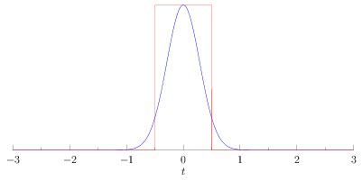
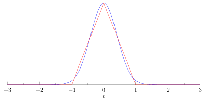
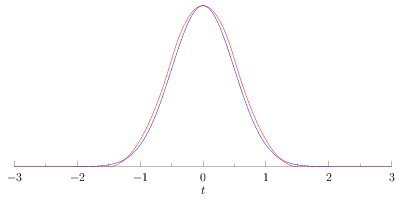
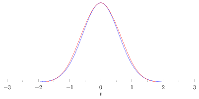

-title=Fast blurs 2
-time=2012-08-01 07:32:52
*This post is part of the series “[Debris: Opening the box](*debris-opening-the-box)“.*

At the end of the last post, I described the basic "moving average" implementation for box filters and how to build a simple blur out of it. I also noted that the approach given only offers very coarse control of the blur radius, and that we'd like to have something better than box filters. So let's fix both of these issues.

### Subpixel resolution

In the previous article, I used 'r' to denote what is effectively the "radius" of a box filter, and our filters always had an odd number of taps 2r\+1. So r=0 has 1 tap \(which is 1, so this is just the identity \- no blur\), r=1 has 3 taps, r=2 has 5 taps and so forth. But how do we get intermediate stages, say r=0.1 or r=1.5?

Well, Jim Blinn once said that "All problems in computer graphics can be solved with a matrix inversion". But here's the thing: Jim Blinn lied to you. Disregard Jim Blinn. Because at least 50% of all problems in computer graphics can in fact be solved using linear interpolation without any matrices whatsoever. And this is one of them. We know how to handle r=0, and we know how to handle r=1. Want something in the middle? Well, just linearly fade in another 1 and then normalize the whole thing so the weights still sum to 1. To implement this, let's split our radius into an integer and fractional component first:

$$r = m + \alpha \quad \textrm{where}\ m \in \mathbb{Z}, 0 \le \alpha < 1$$

Then our blur kernel looks like this:

$$\frac{1}{2r + 1} \begin{bmatrix}\alpha & 1 & 1 & \cdots & 1 & 1 & \alpha \end{bmatrix}$$

with exactly 2m\+1 ones in the middle. This is still cheap to implement \- for example, we could just treat the whole thing as a box filter with r=m, and then add the two samples at the ends with weight α after the fact \(and then apply our usual normalization\). This is perfectly reasonable and brings us up to four samples per pixel instead of two, but it's still a constant cost independent of the length of the filter, so we're golden.

However there's a slightly different equivalent formulation that fits in a bit better with the spirit of the filter and is very suitable when texture filtering hardware is available: consider what happens when we move one pixel to the right. Let's look at our five\-tap case again \(without normalization to keep things simple\) and take another look at the differences between adjacent output samples:

$$y(n) = \alpha \, x(n-2) + x(n-1) + x(n) + x(n+1) + \alpha \, x(n+2)$$
<br>$$y(n+1) = \alpha \, x(n-1) + x(n) + x(n+1) + x(n+2) + \alpha \, x(n+3)$$

$$y(n+1) - y(n) \\ = ((1-\alpha) x(n+2) + \alpha \, x(n+3)) - ((1-\alpha) x(n-1) + \alpha \, x(n-2))$$

On the right side, we add a new pixel at the right end with weight α, and we need to "upgrade" our old rightmost pixel to weight 1 by adding it in again weighted with \(1\-α\); we do the same on the left side to subtract out the old samples. Interestingly, if you look at what we're actually adding and subtracting, it's just linear interpolation between two adjacent samples \- i.e. linear filtering \(the 1D version of bilinear filtering\), the kind of thing that texture sampling hardware is great at!

Time to update our pseudocode: \(I'm writing this using floats for convenience, in practice you might want to use fixed point\)

```
  // Convolve x with a box filter of "radius" r, ignoring boundary
  // conditions.
  float scale = 1.0f / (2.0f * r + 1.0f); // or use fixed point
  int m = (int) r; // integer part of radius
  float alpha = r - m; // fractional part

  // Compute sum at first pixel
  float sum = x[0];
  for (int i=0; i < m; i++)
    sum += x[-i] + x[i];
  sum += alpha * (x[-m] + x[m]);

  // Generate output pixel, then update running sum for next pixel.
  // lerp(t, a, b) = (1-t)*a + t*b = a + t * (b-a)
  for (int i=0; i < n; i++) {
    y[i] = sum * scale;
    sum += lerp(alpha, x[i+m+1], x[i+m+2]);
    sum -= lerp(alpha, x[i-m], x[i-m-1]);
  }
```

I think this is really pretty slick \- especially when implemented on the GPU, where you can combine the linear interpolation and sampling steps into a single bilinear sample, for an inner loop with two texture samples and a tiny bit of arithmetic. However nice this may be, though, we're still stuck with box filters \- let's fix that one too.

### Unboxing

Okay, we know we can do box filters fast, but they're crappy, and we also know how to do arbitrary filters, but that's much slower. However, we can build better filters by using our box filters as a building block. In particular, we can apply our box filters multiple times. Now, to give you an understanding of what's going on, I'm going to switch to the continuous domain for a bit, because that gets rid of a few discretization artifacts like the in\-between box filters introduced above \(which make analysis trickier\), and it's also nicer for drawing plots. As in the introduction, I'm not going to give you a proper definition or theory of convolution \(neither discrete nor continuous\); as usual, you can step by [Wikipedia](http://en.wikipedia.org/wiki/Convolution) if you're interested in details. What we need to know here are just two things: first, there is a continuous version of the discrete convolution we've been using so far that behaves essentially the same way \(except now, we perform integration instead of the finite summation we had before\), and second, convolution is associative, i.e. $$(f * g) * h = f * (g * h)$$. In our case, we're gonna convolve our image I with a box filter b multiple times, and for this case we get something like $$b * b * I = (b * b) * I$$. Point being, applying a box filter p times is equivalent to filtering the image once with a filter that's a box convolved p\-1 times with itself.

In other words, using just our single lowly box filter, we can build fancier filters just by applying it multiple times. So what filters do we get? Let's plot the first few iterations, starting from a single box filter with radius 1. Note that in the continuous realm, there really is only one box filter \- because we're not on a discrete grid, we can generate other widths just by scaling the "time" value we pass into our filter function. This is one of the ways that looking at continuous filters makes our life easier here. Anyway, here's the pretty pictures:

Box filter \(p=1\)
<br>Triangle filter \(p=2\)
<br>Piecewise quadratic filter \(p=3\)
<br>Piecewise cubic filter \(p=4\)

These all show the filter in question in red, plotted over a Gaussian with matching variance \($$\sigma^2 = p/12$$\) and scale in blue \(ahem, not to suggest any conclusions or anything!\). Triangle filters also have a name \(which is just as inspired as "box filter", natch\), the other ones I've labeled simply by what type of function they correspond to. Anyway, the point to take away here is that convolving a box with itself quickly leads to pretty smooth functions \(the [Cardinal B-splines](http://en.wikipedia.org/wiki/B-spline), in fact\) that happen to get quite similar to a Gaussian very fast. In fact, as we keep increasing p \(the order\), they will converge towards a "real" Gaussian \- proof [here](http://bigwww.epfl.ch/publications/unser9201.pdf) for the curious. \(You can also stay with the discrete version and prove this using the Central Limit Theorem, but I like this version more\). The piecewise cubic function you get for p=4 above is already within 3% \(absolute\) error of the corresponding Gaussian. In practice, exact match with a Gaussian isn't that important anyway as long as you're just blurring images, and just using p=3 is normally fine.

So, to get better filters, just blur multiple times. Easy! So easy in fact that I'm not gonna bore you with another piece of pseudocode \- I trust you can imagine a "do this p times" outer loop on your own. Now, to be fair, the convolutions I showed you were done in the continuous domain, and none of them actually prove anything about the modified box filters we're using. To their defense, we can at least argue that our modified box filter definition is reasonable in that it's the discretization of the continuous box filter with radius r to a pixel grid, where the pixels themselves have a rectangular shape \(this is a fairly good model of current displays\). But if we actually wanted to prove consistency and convergence using our filters, we'd need to prove that our discrete version is a good approximation of the continuous version. I'll skip that here since it gets technical and doesn't really add anything if you just want fast blurs, but if you want to see proof \(and also get an exact expression for the variance of our iterated modified box filters\), [this paper](http://www.mia.uni-saarland.de/Publications/gwosdek-ssvm11.pdf) has the answers you seek.

### Implementation notes

And that's really all you need to know to get nice, fast quasi\-Gaussian blurs, no matter how wide the kernel. For a GPU implementation, you should be able to more or less directly take my pseudo\-code above and turn it into a Compute Shader: for the horizontal blur passes, have each thread in a group work on a different scan line \(and for vertical passes, have each thread work on a different row\). To get higher orders, you just keep iterating the passes, ping\-ponging between destination render targets \(or UAVs if you want to stick with DX11 terminology\). Important caveat: I haven't actually tried this \(yet\) and I don't know how well it performs; you might need to whack the code a bit to actually get good performance. As usual with GPUs, once you have the basic algorithm you're at best half\-done; the rest is figuring out the right way to package and partition the data.

I can, however, tell you how to implement this nicely on CPUs. Computation\-wise, we'll stick exactly with the algorithm above, but we can eke out big wins by doing things in the right order to maximize cache hit ratios.

Let's look at the horizontal passes first. These nicely walk the image left to right and access memory sequentially. Very nice locality of reference, very good for memory prefetchers. There's not much you can do wrong here \- however, one important optimization is to perform the multiple filter passes *per scanline* \(or per group of scanlines\) and not filter the whole image multiple times. That is, you want your code to do this:

```
for (int y=0; y < height; y++) {
  for (int pass=0; pass < num_passes; pass++) {
    blur_scanline(y, radius);
  }
}
```

and not

```
// Do *NOT* do it like this!
for (int pass=0; pass < num_passes; pass++) {
  for (int y=0; y < height; y++) {
    blur_scanline(y, radius);
  }
}
```

This is because a single scan line might fit inside your L1 data cache, and very likely fits fully inside your L2 cache. Unless your image is small, the whole image won't. So in the second version, by the point you get back to y=0 for the second pass, all of the image data has likely dropped out of the L1 and L2 caches and needs to be fetched again from memory \(or the L3 cache if you're lucky\). That's a completely unnecessary waste of time and memory bandwidth \- so avoid this.

Second, vertical passes. If you implement them naively, they will likely be significantly slower \(sometimes by an order of magnitude!\) than the horizontal passes. The problem is that stepping through images vertically is not making good use of the cache: a cache line these days is usually 64 bytes \(even 128 on some platforms\), while a single pixel usually takes somewhere between 4 and 16 bytes \(depending on the pixel format\). So we keep fetching cache lines from memory \(or lower cache levels\) and only looking at between 1/16th and 1/4th of the data we get back! And since the cache operates at cache line granularity, that means we get an effective cache size of somewhere between a quarter and a sixteenth of the actual cache size \(this goes both for L1 and L2\). Ouch! And same as above with the multiple passes, if we do this, then it becomes a lot more likely that by the time we come back to any given cache line \(once we're finished with our current column of the image and proceeded to the next one\), a lot of the image has dropped out of the closest cache levels.

There's multiple ways to solve this problem. You can write your vertical blur pass so that it always works on multiple columns at a time \- enough to always be reading \(and writing\) full cache lines. This works, but it means that the horizontal and vertical blur code are really two completely different loops, and on most architectures you're likely to run out of registers when doing this, which also makes things slower.

A better approach \(in my opinion anyway\) is to have only one blur loop \- let's say the horizontal one. Now, to do a vertical blur pass, we first read a narrow stripe of N columns and write it out, transposed \(i.e. rows and columns interchanged\), into a scratch buffer. N is chosen so that we're consuming full cache lines at a time. Then we run our multiple horizontal blur passes on the N scan lines in our scratch buffer, and finally transpose again as we're writing out the stripe to the image. The upshot is that we only have one blur loop that gets used for both directions \(and only has to be optimized once\); the complexity gets shifted into the read and write loops, which are glorified copy loops \(okay, with a transpose inside them\) that are much easier to get right. And the scratch buffer is small enough to stay in the cache \(maybe not L1 for large images, but probably L2\) all the time.

However, we still have two separate copy loops, and now there's this weird asymmetry between horizontal and vertical blurs. Can't we do better? Let's look at the sequence of steps that we effectively perform:

1. Horizontal blur pass.
2. Transpose.
3. Horizontal blur pass.
4. Transpose.

Currently, our horizontal blur does step 1, and our vertical blur does steps 2\-4. But as should be obvious when you write it this way, it's actually much more natural to write a function that does steps 1 and 2 \(which are the same as steps 3 and 4, just potentially using a different blur radius\). So instead of writing one copy loop that transposes from the input to a scratch buffer, and one copy loop that transposes from a scratch buffer to the output, just have the horizontal blur always write to the scratch buffer, and only ever use the second type of copy loop \(scratch buffer to output with transpose\).

And that's it! For reference, a version of the Werkkzeug3 Blur written using SSE2 intrinsics \(and adapted from an earlier MMX\-only version\) is [here](https://github.com/farbrausch/fr_public/blob/master/altona_wz4/wz4/wz4frlib/wz3_bitmap_code.cpp) \- the function is `GenBitmap::Blur`. This one uses fixed\-point arithmetic throughout, which gets a bit awkward in places, because we have to work on 32\-bit numbers using the MMX set of arithmetic operations which doesn't include any 32\-bit multiplies. It also performs blurring and transpose in two separate steps, making a pass over the full image each time, for no good reason whatsoever. :\) If there's interest, I can write a more detailed explanation of exactly how that code works in a separate post; for now, I think I've covered enough material. Take care, and remember to blur responsibly!