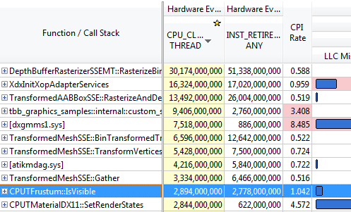
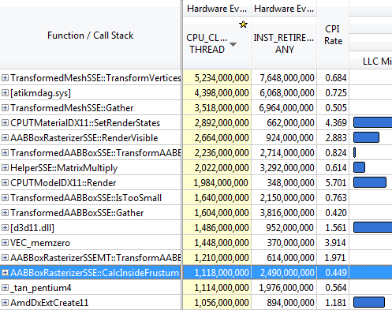

-title=Frustum culling: turning the crank
-time=2013-02-02 12:22:15
*This post is part of a series \- go [here](*optimizing-sw-occlusion-culling-index) for the index.*

In the past few posts, we've been looking at Intel's [Software Occlusion Culling sample](http://software.intel.com/en-us/vcsource/samples/software-occlusion-culling). This post is going to be a bit shorter than the others so far. This has two reasons: first, next up is the rasterizer. It turns out there's another common performance problem we're gonna see in this series, but right now, fixing it is not going to make much of a difference: as it is, the rasterizer in the sample is fairly well balanced, and it's not making any serious mistakes. In other words, this time round, we don't get any easy pickings. Unlike the somewhat peripheral framework code we've been looking at so far, this is the actual heart of this sample, and it was written by people who know what they're doing. Speeding it up is going to take some actual algorithmic improvements, which means a lot of prep work for me, since I'll need to teach you the necessary groundwork first. :\) This is gonna take several posts, but I promise that we'll get a properly satisfying finale.

Well, that's the first reason. The second reason is that I've actually had people complain about the rate at which I'm posting these, because they're falling behind on reading! Sheesh. You slackers \- try writing the damn things! :\) Anyway, I'm going to give you this one for the road, and then I'm gonna stop for the weekend so you can catch up and I can start mentally preparing for the figures on rasterization I'm gonna have to produce. A picture may be worth a thousand words, but making a decent illustration takes me a lot longer than writing a thousand words does, so it's not a happy trade\-off.

Anyway, enough introduction. One final batch of frustum cull optimization coming right up. Let's get cracking.

### What we need here is some work ethic

So the whole point of my last post was that you can often make a big difference with fairly small changes, provided you know what you're doing \- minimally invasive surgery, so to speak. This has lots of advantages: it's easy to write and review, very testable, and less likely to cause major disruptions or cause friction with other existing code. When we last saw our frustum culling code, we managed to speed it up by a factor of over 4.5x by a handful of fixes, none of which touched more than 3 lines of code. That's both satisfying and impressive to family and friends \(if you have the kind of family which tends to be impressed by these things\), and it got us from a \#4 location in our hot spot list all the way down to \#10:



But as you can see, while that blue bar denoting Level\-3 cache misses has gotten considerably shorter, it's still there, and a lot of the things I mentioned in the previous part are still true: in particular, one instance of our `TransformedAABBoxSSE` is still well above the size of a cache line, and while we've managed to beat it all into a shape where the prefetcher works for us, we're still only accessing 25 bytes per cache line, best case. That's over 60% of our memory bandwidth wasted. Surely, we can do better?

Well, of course we can, but this time we're gonna have to roll up our sleeves and do some more invasive changes to our code. Let's first recap the struct layout:

```
class TransformedAABBoxSSE
{
    // Methods elided

    CPUTModelDX11 *mpCPUTModel;
    __m128 *mWorldMatrix;
    __m128 *mpBBVertexList;
    __m128 *mpXformedPos;
    __m128 *mCumulativeMatrix; 
    bool   *mVisible;
    float   mOccludeeSizeThreshold;
    __m128 *mViewPortMatrix; 

    float3 mBBCenter;
    float3 mBBHalf;
    bool   mInsideViewFrustum;
    bool   mTooSmall;
    float3 mBBCenterWS;
    float3 mBBHalfWS;
};
```

The part we care about right now is at the bottom: The two bools and the world\-space bounding box. Now, it turns out that while one of the bools \(`mTooSmall`\) gets written by the function `TransformedAABBoxSSE::IsTooSmall`, nobody ever *reads* it \- everyone just uses the return value of `IsTooSmall`. So we can just make it a local variable in that function and stop spending per\-instance memory on it. That one's fairly easy.

### Ta data rhei

For `mInsideViewFrustum` though, we're going to have to work a bit more. In particular, we're gonna have to understand the actual dataflow patterns to figure out where the right place to put it is.

We already know that it gets set in `IsInsideViewFrustum`, because we've spent some time looking at that function already, although it's gotten shorter since we last saw it:

```
void TransformedAABBoxSSE::IsInsideViewFrustum(CPUTCamera *pCamera)
{
    mInsideViewFrustum = pCamera->mFrustum.IsVisible(mBBCenterWS,
        mBBHalfWS);
}
```

Unfortunately, unlike the previous case, `IsInsideViewFrustum` doesn't have a return value, so our boolean flag is actual state, and there's two more methods that access it, one of which is *also* called `IsInsideViewFrustum`. I'm really not a fan of overloading when the two methods do completely different things \- it's confusing and error\-prone \- but I digress. Both of the other methods are inline:

```
inline void SetInsideViewFrustum(bool insideVF)
{
    mInsideViewFrustum = insideVF;
}

inline bool IsInsideViewFrustum()
{
    return mInsideViewFrustum;
}
```

And both of these get called from the outside, so we can't simply nuke them. However, lucky for us, these dependencies don't go very far upstream in the call graph at all. So let's have a look where our three frustum cull\-related functions get called. First, the function that updates our visibility state. Turns out there's only two callers. Let's look at the first one:

```
void AABBoxRasterizerSSEST::IsInsideViewFrustum(CPUTCamera *pCamera)
{
    mpCamera = pCamera;
    for(UINT i = 0; i < mNumModels; i++)
    {
        mpTransformedAABBox[i].IsInsideViewFrustum(mpCamera);
    }
}
```

Straightforward enough. The second one is in the class `AABBoxRasterizerSSEMT`, which does the exact same thing with some additional setup to figure out which part of the model list each task needs to process \(it's multi\-threaded, as the name suggests\). Both classes derive from the base class `AABBoxRasterizer`, which holds a bunch of things common to both the single\- and multi\-threaded implementations, including the array of `TransformedAABBoxSSE`s.

Because there's first a global frustum culling pass on multiple threads, which is only then followed by a second pass that looks at the results, we can't simply get rid of the per\-model bookkeeping: it's actual state. Let's look at the callers of the no\-parameters version of `IsInsideViewFrustum` to figure out where that state is read:

```
void AABBoxRasterizerSSEST::TransformAABBoxAndDepthTest()
{
    mDepthTestTimer.StartTimer();

    for(UINT i = 0; i < mNumModels; i++)
    {
        mpVisible[i] = false;
        mpTransformedAABBox[i].SetVisible(&mpVisible[i]);
        
        if(mpTransformedAABBox[i].IsInsideViewFrustum() &&
           !mpTransformedAABBox[i].IsTooSmall(
               mViewMatrix, mProjMatrix, mpCamera))
        {
            mpTransformedAABBox[i].TransformAABBox();
            mpTransformedAABBox[i].RasterizeAndDepthTestAABBox(
                mpRenderTargetPixels);
        }               
    }
    mDepthTestTime[mTimeCounter++] = mDepthTestTimer.StopTimer();
    mTimeCounter = mTimeCounter >= AVG_COUNTER ? 0 : mTimeCounter;
}
```

And again, there's a multi\-threaded version that does pretty much the same, and no other callers. 

Finally, searching for callers to `SetInsideViewFrustum` turns up exactly one hit, an inline function in `AABBoxRasterizerSSE`:

```
inline void ResetInsideFrustum()
{
    for(UINT i = 0; i < mNumModels; i++)
    {
        mpTransformedAABBox[i].SetInsideViewFrustum(true);
    }
}
```

As far as dataflow expeditions go, this one was pretty much as tame as it gets: it's all concentrated in a few source files, among functions that are directly related and are at similar levels of the call tree. Refactoring this won't be hard at all. Mind you, this is pretty much the best\-case result \- we got off lightly. In a lot of codebases, doing this kind of thing will quickly lead you to realize that the banana you're interested in [and the gorilla holding it](http://www.johndcook.com/blog/2011/07/19/you-wanted-banana/) are very tightly coupled. But now that we've determined that's not the case, how do we rearrange things for better cache efficiency?

### Shuffling data around

As we just saw, `AABBoxRasterizerSSE` and its subclasses are clearly in charge of running the whole frustum culling operation. Not only do they trigger the frustum culling computation, they also hold the array of bounding boxes, and they're the only ones who actually look at the frustum culling results. That suggests that `AABBoxRasterizerSSE` is the natural place to put our frustum calling state. So let's add an array of `bool`s for the visibility state of the boxes, and make it parallel to the array we already have:

```
class AABBoxRasterizerSSE : public AABBoxRasterizer
{
  // ...
  TransformedAABBoxSSE *mpTransformedAABBox;
  bool *mpBBoxVisible; // <--- this is new
  // ...
};
```

This needs to be allocated and freed, but all of that is perfectly routine, so I won't go into it. And once we've added it, we have a fairly simple plan of attack:

* Replace all calls to `mpTransformedAABBox[i].IsInsideViewFrustum()` \(the version without arguments\) by `mpBBoxVisible[i]`.
* Similarly, replace calls to `SetInsideViewFrustum` by the corresponding assignment.
* Instead of writing the culling state to a member variable, have `IsInsideViewFrustum(camera)` \(the update version\) return the frustum culling state, and write it to the corresponding slot in `mpBBoxVisible` at the call site.
* Get rid of `TransformedAABBoxSSE::mInsideViewFrustum` now that it's unreferenced.

Each of these items results in a handful of changes; the complete diff is [here](https://github.com/rygorous/intel_occlusion_cull/commit/28e18336b1ae054e5afca0f03bcc8039163ed2de), for the curious.

And presto, we have a densely packed visibility state array \(well, not that densely packed, since we still use a whole byte to store what's effectively a 1\-bit flag, but you get the idea\). By itself, that won't buy us much in the frustum culling pass, although it's likely to make the later pass that checks for visible boxes faster, since we now never need to fetch the whole `TransformedAABBoxSSE` from memory if it was frustum culled.

But we can now turn the crank one more time and do the same with the world\-space bounding boxes, creating yet another array held by `AABBoxRasterizerSSE`. We also move the actual visibility test to `AABBoxRasterizerSSE` \(since the test function is a one\-liner, that's a simple change to make\), wrap it inside a loop \(since we're always going to be culling a group of models\), and call it from the two original frustum\-culling loops in the single\-threaded and multi\-threaded rasterizer variants with the correct loop bounds. All of this is in [this commit](https://github.com/rygorous/intel_occlusion_cull/commit/bd29f465c1f607e9e13a9df37d4fb5351877f66a) \- as you can see, again it turns out to be mostly small changes.

Finally, for bonus points, we do some cleanup and remove the now\-unnecessary fields and methods from `TransformedAABBoxSSE`. That's in [this commit](https://github.com/rygorous/intel_occlusion_cull/commit/0a82ba4330afb718836a4667d154a6f943f12e65).

And just like that, we have our bounding boxes densely packed in a nice linear array, and the output visibility flags densely packed in another array. No more reading a whole cache line to only use 25 bytes \- this time, we look at everything in the cache lines we access, and we access it all sequentially. That should result in better cache hit rates, lower memory bandwidth usage, and generally better performance. But how much does it actually buy us? Let's find out!



Whoa \- almost down to a third of what we had before we started \(for the record, the last few times, I've tried to keep run lengths roughly consistent so we can actually compare the cycles directly\). Our CPI rate is done below 0.5 \- meaning we run at over two instructions executed per clock cycle, sustained, through the whole loop.  Those pesky L3 cache misses? Gone completely. And we seem to be surrounded by a lot of functions we haven't seen before in this series, because by now we're at rank 20 in the hot spots list \- down by another 10 positions! \(But wait, is that tan\(\) right below us? [What the hell is that doing there...](*finish-your-derivations-please) ah well, never mind\).

When people tell you that you should optimize for cache usage patterns above all else, *this* is what they mean.

Well, even before we started, the frustum culling performance was good enough that there was no pressing need to deal with it immediately. At this point, it's fast enough that we should really focus our attention elsewhere; there are bigger fish to fry. But then again... we seem to be on a winning streak, so why stop now? Let's aim for some extra credits and see if we can push it a bit further.

### Up To Eleven

Now, since I'm cropping the screenshots heavily to make them fit in the blog layout, you can't see what I see. For all the screen shots we've seen so far, I've always made the columns narrow and sorted them so that whatever I want to show you happens to be next to the labels. But what you actually get out of the "General Exploration" analysis I've had VTune run is more than 20 columns worth of various counters. So for most of the functions on the screen, there's a bunch of other blue bars and counters that I haven't shown you, representing various kinds of bottlenecks.

So you can't see what I see, namely: absolutely nothing next to `CalcInsideFrustum`. In short, there's nothing significant left to be gained by modifying data layout or implementation details. This code runs as smoothly as code can be expected to run. If we want to make things go faster still, we actually have to do less work.

Luckily, there's still one source of inefficiency in the current algorithm: we pass in one box at a time, and test it against all 6 frustum planes. Now, this code uses SSE to test against 4 planes simultaneously, so it's a fairly decent implementation. But the second half of the test only gives us 2 more planes; the other 2 SIMD lanes are wasted.

This can be fixed by turning the packing around: instead of testing one box against groups of four planes at a time, we test groups of four boxes against one plane at a time. Because we have a lot more boxes than we have planes, that means we have a lot less wasted work overall, at least potentially: the old test always checks one box against 8 planes, of which we actually care about 6. That means 6/8=75% of the computations done are useful. If we instead test groups of four boxes at a time, we run at perfect utilization except for the very last group, which might have less than 4 boxes in it if our total number of boxes is not divisible by four.

Of course, to do this, we need to reorder our box structures so we can grab those four boxes efficiently. Given that the original goal of this post was to be shorter than the other ones and I'm already above 2300 words, I'm not going to delve into the details here, but again, you can just [look at the code](https://github.com/rygorous/intel_occlusion_cull/commit/34d60ce0fc8d5409784d26b19c210d1f0033da81). So, does it help?


You bet. In fact, if you compare the numbers, we come pretty close to the 1.33x speedup you would expect when increasing utilization from 75% to near 100%. However, as you can see, our clocks per instruction went up again, and our L3 misses. That's because we're now starting to outrun the cache prefetching again.

Now, I have a processor with AVX support, and if we were compute limited, we could try use 8\-wide SIMD instead of 4\-wide SIMD. But considering that we already seem to be processing data faster than we can fetch it, there's not much point to it. I tried it anyway to be certain, and sure enough, it's really mostly a way of turning code with slightly too little computation per data item into code with far too little computation per data item. Now given what I saw in that code, I believe that things might look slightly differently in x64 mode, where we get 8 more YMM registers that this code could really make great use of, but I didn't look into it; this post has gone on for long enough already.

### Conclusions

I still stand by what I said in my previous post, namely that you don't need to go full\-on Data\-Oriented Design to get good performance on modern CPUs. But all that said, if you're willing to put in the effort, it definitely does pay off: we got a 3.33x speedup *on code that was already using SSE to begin with*. Stop counting ALU cycles, people. As this series should have shown you by now, it's really not so much about what happens when your code runs \- it's about getting rid of the things that make it grind to a halt. As you just saw, data density makes a *huge* difference in cache efficiency \(and hence execution times\), and the widest ALUs in the world won't do you any good if you can't keep them fed.

And on that note, I'm gonna let this particular pipeline drain over the weekend so you have some time to let it all settle :\). See you next time!