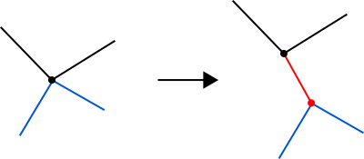
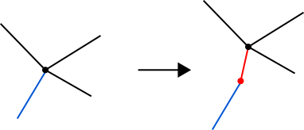
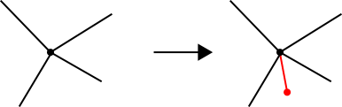
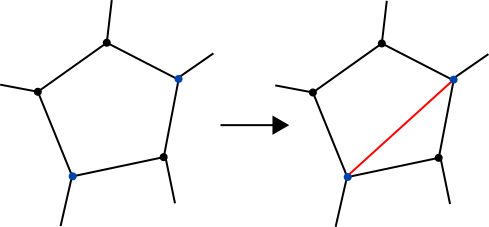
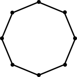
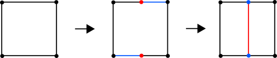

-parent=debris-opening-the-box
-title=Half-edge based mesh representations: practice
-time=2012-03-25 01:49:13

Welcome back. Now that I've covered the underlying ideas behind the mesh data structure used in GenMesh \(the older out of two mesh generators used in "Debris"\), this post will focus on the practical considerations; it turns out that most mesh operations we need can be expressed in terms of a small number of primitive transformations. But I'll start with some practicalities of representing our data structure.

### Storing connectivity

In the [previous post](*half-edge-based-mesh-representations-theory), I've explained the abstract data structure, but not the actual implementation. As you hopefully remember, we ended up with a lot of pointers. The actual data structures used in GenMesh are descended from that representation, but slightly different in various ways:

* There's some extra fields per vertex, edge and face to keep track of user selections; this is important but obvious stuff, so I won't spend any time describing it here.
* We don't actually store the Vertex→Half\-edge links \(outgoing half\-edge for every vertex\) since they are only used by a small subset of all operations. Those few operations just do an extra pass to extract and cache this information; this ends up being simpler and smaller \(though of course not faster\) than ensuring those links stay up to date.
* All physical wedges corresponding to the same vertex are kept in a circular linked list, exactly like [Tom](*half-edge-based-mesh-representations-theory#comment-396) suggested in his comment to my first article. This is in addition to the logical wedge structure described in the first part. Turns out that either the crease\-based or the circular\-linked version is fine, but combining both in the same data structure was a bad idea that makes certain operations unnecessarily complicated. I don't recommend this, but this article describes the code I wrote, not the code I should have written. :\)
* Instead of pointers, all vertices, faces and edges are stored in a single dynamic array \(aka "vector"\) in the mesh. They're then referenced by their IDs. This has two advantages: first, it's easy to make a secondary data structure that maps vertices, faces, edges etc. to something; because they all have sequential, dense IDs, a simple array will do. Much simpler \(and also smaller and faster\) than using an associative data structure keyed off pointers. Second, it turns out to be useful for the way we store edges and half\-edges:
* Half\-edges are paired with their opposite neighbor and stored as... edges. This also gives us a place to store per\-edge information like selection and crease flags. So why is this still a half\-edge structure? The crucial part is that unlike e.g. a quad\-edge structure, the two half\-edges making up such an edge are still directed and individually addressable. The edge with ID `e` is made up of the two half\-edges with IDs `e*2` and `e*2+1`, with `opposite(e*2) = e*2+1` and `opposite(e*2+1) = e*2` \- i.e. the "opposite" operation on a half\-edge ID just flips the lowest bit. One pointer per half\-edge less to store, one pointer less that needs to be maintained.
* Finally, there's also some `Temp` fields for every element that are used as scratch\-pads by the various operators. Because you don't want to have to spin up auxiliary arrays every single time you need to remember a value for a bit.

Anyway, enough talk. Have some code so you can see what it actually looks like: \(this is slightly cleaned up, i.e. I skip fields that are still in the code but not actually used in any existing code paths\)

```
struct GenMeshElem // same for all elements of a mesh
{
  U8 Mask;     // (bitfield) 8 user selection masks/item
  bool Select; // selected or not?
};

// Note: I'm going to write "Vert" instead of "physical wedge"
// here and in the following, using the full "Vertex" when
// referring to the topological entity.
struct GenMeshVert: public GenMeshElem // Physical wedge
{
  int Next;    // Next physical wedge for this vertex (cyclic list)
  int First;   // First physical wedge for this vertex
  int Temp, Temp2;
};

struct GenMeshEdge: public GenMeshElem // An edge.
{
  int Next[2];  // next(e) for both half-edges
  int Prev[2];  // prev(e)
  int Face[2];  // face(e)
  int Vert[2];  // start(e)

  int Temp[2];  // temp fields - various uses
  int Crease;   // crease flags
};

struct GenMeshFace : public GenMeshElem     // face of a mesh
{
  int Material; // material index (0 if deleted face)
  int Edge;     // one outgoing edge index
  int Temp[3];  // some temp fields
};
```

A mesh, then, holds arrays of Verts, Faces and Edges \(plus some meta\-data on materials and so forth that I won't get into here\).

As alluded to in the previous article, it's not so much about directly manipulating this data structure, because that tends to get hairy fast. Instead, most of the mesh processing code either performs read\-only accesses on this structure \(which is easy\) or tries to express all modifications in terms of simple, local changes. In fact, most topological operations supported by GenMesh can be phrased in terms of just two primitives: vertex splits and face splits.

### Vertex splits

A vertex split takes an existing vertex and splits it into two, adding a new edge between them. Some of the edges incident to the original vertex get attached to the new vertex, while the rest stay where they are. The operation looks like this:
<br>A vertex split being performed.
<br>The blue edges are the edges that get moved to the new vertex, while the black edges stay where they are. The new vertex and edge are drawn in red. The blue edges must be all be consecutive, i.e. there can't be any black "islands" in the middle of a set of blue edges. This means we can specify which edges are blue just by specifying the first and last one. As you can see, the two faces incident to the new edge gain one new edge each. If you invert such a vertex split, you get an edge collapse, the fundamental building block for a whole class of mesh simplification algorithms \(GenMesh does not implement this operation, though\).

 We can also use the same edge as both first and last one \- i.e. there is only one blue edge. This special case effectively inserts another vertex on the blue edge \- no need to have a separate operation for this, pretty neat. Here's how it looks:
<br>A vertex split with only one blue edge.
<br>But wait, there's more! You can also have an empty set of blue edges, which means you just add a vertex to a mesh with an edge that connects it to an existing face. This face will contain *both* half\-edges making up the edge \- you first walk from the old vertex to the new vertex, and then back again. Weird, I know, and not something you want in a final mesh, but it makes for a very useful intermediate stage sometimes; it's used by the Catmull\-Clark subdivision code, for example. Again, here's a picture:

A vertex split with no blue edges.

I won't provide any code for this \(or for the remaining operations in this article\); like modifying doubly\-linked lists, it's mostly an exercise in chasing down all the pointers/indices that need to be modified. You create the new pair of half\-edges \(one `GenMeshEdge`\) and link them in. The code really isn't very helpful to read \- the diagrams above are much more useful to understand what's going on. Anyway, on to the second of our building blocks.

### Face splits

These do exactly what you would expect given the name, and this time there's no tricky special cases:
<br>A face split - a new (red) edge is inserted between the two blue vertices.
<br>This one adds both a new edge and a new face. Note that even though an edge is conceptually inserted between two *vertices* \(and the diagram shows it that way\), what you actually specify is two *half\-edges* from the same face, because the edges are where you actually have to do the pointer manipulations. More importantly, if you do something like the degenerate no\-blue\-edge vertex split described above, a face can \(temporarily\) contain the same vertex more than once, and you have to specify which instance. A face can never contain the same half\-edge twice \(it's simply impossible to represent in the data structure, since each half\-edge only has one "prev" and "next" link\), so the corresponding half\-edge is the canonical way to identify a vertex within a face.

And that's it. These two operations are enough to implement almost all algorithms in GenMesh that modify mesh connectivity in a non\-trivial way. Which is all well and good, but how do we get a mesh in the first place?

### One ring to generate them all... almost

What we need next is some primitives for our artists to start with. Well, this is the part of GenMesh I like the most: We generate almost everything out of a single primitive \- "almost" everything because we also support tori, which have topological genus 1 whereas all other standard primitives have genus 0. Both vertex and face splits preserve topological genus, so tori need to be special\-cased, but I'll get to that later. Let's start with genus\-0 primitives, which we all synthesize from the same seed: a "ring" \(that's what it's called in the code\), which is actually a double\-sided disc. Here's an 8\-sided specimen, but you can generate them with an arbitrary number of vertices:
<br>
<br>An `n`\-sided ring \(`n > 2`\) has `n` vertices and edges and two faces \(the front and the back\). GenMesh always generates them with the vertices describing a regular polygon in the z=0 plane \(radius and rotation are configurable\).

So where can we go from here? Well, it turns out that vertex and face splits are enough to implement the topological modifications underlying mesh extrusion \(how exactly is the subject of its own article in this series\). Starting from a n\-sided ring, it's obvious that we can generate a n\-sided cylinder by just extruding along the z\-axis. But what else can we do with it? Here's a list of recipes just using rings and extrusion:

* **Cylinder** and **tessellated cylinder**: Extrude ring along z axis; repeat multiple times to get a tessellated cylinder.
* **Grid**: A 1x1 "grid" is just a ring with 4 sides. 
    <br>
* **Cube**: A cube is just a cylinder with a 4\-sided \(1x1 grid\) base, really.
* **Tessellated cube**: Start from a tessellated cylinder with a 4\-sided base. That gives you a cube tessellated along the z axis. Now select all faces on the \+y side of the cube, and extrude them as often as necessary along the y axis. Rinse and repeat for x\-tessellation. Voila, tessellated cube. Let it cool for a bit, then finish by adding creases along the hard edges. :\)
* **Sphere**: You can describe a sphere as a distorted, tessellated cylinder \- just start from a cylinder, then move the vertices around after you're done. Note that this will give a sphere that has a flat face at the top and bottom, instead of single vertices at the poles. If you want a sphere with "proper" poles, see below.
* **Cone**: A cone is just a warped cylinder that converges to a single point. In other words, start with a tessellated cylinder again, then add one extra vertex for the top, the same way you add the poles for a sphere \- again, see below.

As you can see, this covers most of the usual suspects, except for tessellated grids \(the extrude trick we pulled for tessellated cubes doesn't work there, since grids are 2D entities\) and the aforementioned tori.

### Those pesky poles

We ran into that slight problem above with spheres and cones where we might want to have proper poles or a sharp apex, respectively, instead of just stopping with a flat face. Not to worry \- this can be fixed using our existing operations. Ultimately, what we really need to do is add a center vertex in the middle of a ring,  and then add a bunch of new triangles connecting the existing sides of the face to that vertex. Using our general vertex and face splits, this is pretty easy:


Start with a degenerate vertex split \(no blue edges\) to insert the center point and first "spoke" edge. After that, it's just a matter of splitting the \(ever\-shrinking\) remainder of the original face `n-1` times to insert the remaining "spokes".

The same approach can be used to subdivide faces in general. If you advance in steps of 2 "outside" edges inside of 1 for every step, you tessellate the face using quads, not triangles. It's pretty nifty.

And as usual, after you have the connectivity right, you can just move the vertices around to wherever you need them.

### Tessellated grids

These start out from a regular 1x1 grid \(aka 4\-ring\), but then proceed somewhat differently. Here's the sequence:


<br>You start out with a quad. You then split the "top" and "bottom" edges \- as mentioned above, this is just a vertex split with a single blue edge. Repeat as many times as necessary to get your desired tessellation factor in x. After that, it's just a bunch of face splits \(note you need to do this on both the front and back sides!\) to get an x\-tessellated grid.

Repeat the same process \("rotated by 90 degrees", except topologically all that means is you start from a different half\-edge\) in all of the newly created quads to tessellate the skinny vertical quads along the y axis, and you're done.

### Tori at last

This leaves just one primitive we don't have yet: the torus. As mentioned above, a torus is genus 1 so it can't possibly be generated from a ring using our operations, which preserve topological genus. It can, however, be generated from something very similar \(in some sense, it's actually simpler\). I'm not gonna draw a picture for this one, because it needs 3D and I'm not gonna embarrass myself trying to do that with my inferior Inkscape skills :\).

Anyway, your start mesh for a torus has 1 vertex, 1 face and 2 edges \(one "horizontal", one "vertical", both connecting the vertex with itself\). The face first takes the horizontal edge, then the vertical edge, then the horizontal edge backwards \(i.e. opposite half\-edge from the first one\), then the vertical edge backwards \(opposite half\-edge from the second one\). There we go, closed mesh, all 4 half\-edges accounted for, and it really needs toroidal wrapping to be drawn correctly \- it's a torus, what did you expect? Now a 1\-vertex torus isn't exactly a very useful primitive, but you just need that one seed mesh and then do the exact same procedure as for a tessellated grid to get a proper NxM torus. After that, all you need to do is sort out the vertex coordinates :\).

### Wrap\-up

And that's it! You now know a bit more about the data structures used in GenMesh, and how all the primitives you might care about can be generated from a pretty tiny set of starting meshes using all of 2 topology\-modifying operations. That's probably my favorite part of the whole generator; the original implementation didn't do it quite that systematically, and I almost went insane trying to debug it before I reduced everything to this small set of ops. It's surprisingly powerful, and quite elegant too :\).

Subdivision and Extrusion, the two main operations GenMesh was trying to support, will be covered in a separate article that I probably won't get to for a while. Because next up is what you've been waiting for: Half\-edges redux, the post that describes the mesh data structures used in GenMinMesh, the \(somewhat\) more minimal mesh generator we wrote leading up to Debris \- mainly for 64ks, because GenMesh is kinda big and, as you can imagine from the above description, has lots of interdependencies that make it hard to throw out functionality selectively to save space.

Anyway, I'll try to finish the next post a bit quicker, though really it all boils down to how quick I get those damn pictures done. Until then!
