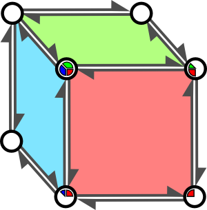

-title=Half-edge based mesh representations: theory
-time=2012-02-21 08:38:07
*This post is part of the series "[Debris: Opening the box](*debris-opening-the-box)".*

Okay, based on my quick poll [here](*debris-opening-the-box), most people would like me to write a bit about the implementations \(there are two\) of half\-edges used in "debris", so that's where I'll start. My initial plan is for this to be a three\-part series \(as outlined in the original post\). We'll see how that goes.

But first, let's start with a tiny bit of history.

### Earlier mesh generators

Our earlier 64ks \(i.e. the stuff done with [Generator](http://www.farbrausch.com/prod.py?which=117) or [RG2](http://www.farbrausch.com/prod.py?which=99)\) had very limited tools for mesh manipulation, most of which were a direct result of the underlying data structures: meshes were stored directly as an array of vertices plus an associated array of indices \(16\-bit vertex indices only, on the HW we were targeting at the time\). There was exactly one vertex format used: position \(3D\) \+ normal \(3D\) \+ UV \(2D\), all floats, for 32 bytes/vertex. Each mesh had exactly one material \(referring, at the time, mainly to the set of associated textures and render states\) associated with it. This had a few advantages:

* The code is really simple and small. \(Big advantage for 64ks\)
* The representation is directly suitable for rendering \- just stuff everything into vertex/index buffers and you're done. Exactly one D3D `DrawIndexedPrimitive` call per mesh.
* Generating primitives and simple vertex deformations are easy in this representation.

But it also had a lot of serious problems:

* We were limited to indexed triangle meshes.
* Meshes with more than 65536 vertices couldn't be correctly represented at all.
* The "one material per mesh" limitation was quite inconvenient for our artists.
* Similarly, "one batch per source mesh" combined with the above limitation made for quite high batch counts \(for the time\). This was usually resolved in a somewhat ad\-hoc fashion by a special "merge" operator that could turn a scene back into a mesh, merging multiple batches into one if they shared the same material.
* Most importantly, anything *but* the aforementioned primitive generators and simple vertex deformers was inconvenient in this representation, so we just didn't support it at all.

The original [Werkkzeug](http://www.farbrausch.com/prod.py?which=113) added support for large meshes \(\>65536 vertices\), more general meshes \(faces had to be convex polygons with \<=8 edges if I remember correctly\), and added Extrusion and Catmull\-Clark subdivision. These last two needed adjacency information; this was dealt with in the code in an ad\-hoc way and had severe limitations: hard\-edged meshes or discontinuous UV mappings didn't work properly.

Interestingly, the mesh representation we eventually ended up preferring \(to be described in what will be "Half\-edge based mesh representations redux"\) was very similar to what the original Werkkzeug did, with some crucial modifications. If I had known this at the time, it would've saved me months of my life and a lot of frustration. But I didn't, and so I wrote `GenMesh`, based on a fairly orthodox link\-based half\-edge representation. The first two articles in this mini\-series will be about this mesh generator.

### Design goals

For `GenMesh`, we wanted the following features:

* The basics we were already used to \- primitives and vertex deformations.
* Support for variable vertex formats.
* No artificial limitations for mesh size \- anything that fits into memory!
* Multiple materials per mesh.
* Polygon\-based meshes \(not just triangles\) \- mainly for Catmull\-Clark subdivision surfaces \(which was a key feature\).
* Proper support for discontinuous attributes.
* Adjacency information is available and up\-to\-date all the time.

That said, we still intentionally left two limitations: we disallowed meshes with boundary edges \(i.e. all our meshes were topologically closed\), and we required that all meshes be 2\-manifold \(which in this case boils down to "no more than two faces may meet at an edge"\). Originally, these limitations were chosen because they make the half\-edge implementation easier, and we had a small hack to support meshes with boundary from the user perspective: keep an explicit boundary face for every hole, but assign it an invisible material. A few months later, we added Shadow Volumes, which happen to have the same two limitations, and the "bug" became a feature: provided you didn't use a few disallowed Operators \(the ones that generated the "virtual holes"\), you knew that your mesh was closed and 2\-manifold. And it was instantly obvious where such "topological defects" were introduced into the mesh. Anyone who's ever tried to guarantee 2\-manifoldness for meshes imported from an art package knows how much of a hassle tracking down such problems is when you don't have that level of control over how your art assets get made.

### Basic half\-edges

You can find good material on the basics online, so I'll keep this section fairly brief. Half\-edges are among the edge\-centric mesh representations. The reason for focusing on edges is quite simple: Face→Edge, Face→Vertex, Vertex→Edge and Vertex→Face are all one\-to\-many\-type relationships in a general polygon mesh, but each edge links exactly 2 vertices and lies \(in a closed, 2\-manifold mesh\) between exactly 2 faces \- a fixed number of pointers \(or indices\), much nicer. Half\-edges make this even more uniform by using directed edges \(in the direction of winding order\). Each half\-edge is incident to one face and one vertex, and a pair of half\-edges makes up a full edge, hence the name.

So how does this all look? Here's the obligatory picture:


<br>This shows a random highlighted half\-edge `e`, going from vertex `a` to vertex `b` \- half\-edges are directed, so order matters. The corresponding half\-edge in the opposite direction is denoted by `opposite(e)`. Our edge `e` is part of face `f` \(blue shaded area\). The classic half\-edge data structure keeps track of:

* Per half\-edge `e`: Either its start or end vertex index \(let's pick `start(e)`, the red vertex, here\), a link to the face `face(e)` it belongs to, links to the previous and next half\-edges `prev(e)` and `next(e)` in the same face \(in winding order\), and a link to the corresponding opposite paired half\-edge `opposite(e)`.
* Per vertex: A link `vertEdge(v)` to one of the outgoing half\-edges \- any will do. \(Equivalently, you can keep track of an incoming half\-edge; again, this is equivalent\)
* Per face: A link `faceEdge(f)` to any of the half\-edges that make up the face.

It's obvious that this structure lets us go from \(half\-\)edge to \(half\-\)edge since that's what we store. It's also obvious that we can enumerate all half\-edges making up a face in\-order just by following the `next` \(or `prev`\) links. And since we can get from half\-edges to vertices, that means we can enumerate all vertices belonging to a face easily too. The one thing that's not immediately obvious is that we can iterate around vertices, too: define

```
prevVert(e) := next(opposite(e))
nextVert(e) := opposite(prev(e))
```

\(look at the diagram to see this does the right thing\) \- note these return a half\-edge, not a vertex index. Again, we can use the `face` link for the corresponding half\-edges to enumerate all faces that touch a given vertex.

### Half\-edge invariants

And that's the classic half\-edge data structure. Doesn't look so bad, right? Unfortunately, there's lots of redundancies in this representation because we keep explicit links for everything to make traversal fast. Which in turn means that there's tons of invariants we have to maintain. Here's the most important ones:

* For every half\-edge `e`, `e = prev(next(e)) = next(prev(e)) = opposite(opposite(e))`, and `face(e) = face(next(e))`.
* For every vertex `v`, `start(vertEdge(v)) = v`.
* For every face `f`, `face(faceEdge(f)) = f`.

Note that while these invariants guarantee a connectivity structure that's free of basic self\-contradictions, you need even more than that to get a meaningful polygon mesh. For example, you would probably require that faces contain at least 3 distinct edges. Another seemingly obvious invariant that I won't require is that `start(next(e)) = start(opposite(e))` \(two seemingly equivalent expressions for `end(e)` in the diagram\). In fact, I'll pick the first expression to define `end`:

```
end(e) := start(next(e))
```

and say nothing at all about the second expression for now. I also won't require for arbitrary edges `e` that `start(e) = start(nextVert(e))`. The reasons for all this should become obvious in a minute.

But first, the list above should give you pause. Anyone who's ever implemented a doubly\-linked list knows that even maintaining a single invariant of the type `prev(next(e)) = next(prev(e))` above requires careful thinking \(and coding\) on any operation that updates the data structure. As a rule of thumb, the more invariants need to be maintained by a data structure or algorithm, the trickier it is to implement, and the more likely an implementation is to contain bugs. That's why doubly\-linked lists are harder than singly\-linked lists, why binary search is harder than linear search, and why balanced search trees are harder than binary search trees, which are in turn harder to get right than sorted lists/arrays. By that metric, then, the list above suggests we're in deep trouble. The only way I know to get this kind of data structure manipulation right and stay sane is to build it out of small, local data structure manipulations that can be understood in isolation. The actual set of operations used by the "old" mesh generator in Werkkzeug3 \(used for Candytron, .kkrieger, Theta, Debris etc.\) is in fact really small \(and somewhat limited\); I'll go into more detail in the next post. 

As a side note, I've only talked about connectivity here; if you plan to interpret this as a polygon mesh, there's also geometric invariants you'd like to be maintained: distinct vertices are at distinct positions, all faces are planar and convex, and so forth. I'll completely ignore this type of constraint and the fix\-ups necessary to enforce them in this series to concentrate on the data structures.

### Attributes and discontinuities

So far, I've described the standard half\-edge data structure, as you'll find it in Computational Geometry and Computer Graphics books \(and numerous articles on the web\). What it doesn't deal with \(so far\) is vertices with associated attributes, such as triangle meshes with normals, UV coordinates \(possibly multiple sets\), vertex colors and so forth. Now, as long as these are all perfectly smooth and interpolated over the mesh, we can still use basic half\-edges as discussed above. But as soon as we have sharp discontinuities, we run into an issue. Now discontinuities in normals can usually be hand\-waved away by using smoothing groups, and the case you're most likely to care about in practice are discontinuities in UV coordinates \(typically seams created during unwrapping\). Nevertheless, I'm going to use vertex colors for the purpose of discussion, because they're easier to draw in a picture. So here I present, for your viewing pleasure, the Rickety Multicolored Cube™:



The funky pie charts inside our oversized vertices are made of, to borrow terminology from [a paper by Hugues Hoppe](http://research.microsoft.com/en-us/um/people/hoppe/efficientpm.pdf), "wedges". A wedge is a set of attributes \(normals, UV coordinates etc.\) used by at least one face \(but possibly more\) incident to a vertex. This virtual cube has a different color on every side, which means that each of the 8 corner vertices has 3 associated wedges, one for each side. If I were to draw a tessellated cube with 2x2 quads making up each face, there'd also be vertices in the middle of each cube edge that only have 2 wedges, and vertices at the center of the cube faces that only have one wedge \(i.e. no discontinuities at all, which is in fact the case for most vertices in a normal mesh\). You'll have to imagine that picture, since even the simplified, incomplete, skewed version you see above took me ages to draw.

Now, whenever any single attribute \(in this case color\) varies between any of the faces incident to a vertex, we have multiple wedges. However, just because one attribute is discontinuous doesn't mean that all of them are; for example, you might have discontinuous normals across an edge but still want to interpolate UV coordinates smoothly. To resolve this case correctly, Werkkzeug3 stores what I call "crease flags" for each edge \(yes, per *edge* not *half\-edge*\).  This is just a single bit per attribute to denote whether this attribute has a discontinuity across the given edge or not. To visualize this, imagine that each attribute has its own set of wedges \(I'll call these "logical wedges", and they depend on the attribute; "physical wedges", the things we actually store, do not\). The boundaries in the "pie chart" are exactly along the edges where the corresponding crease flag is set. Now, what we actually store is just the physical wedges. Whenever there's a discontinuity in any of the attributes \(i.e. whenever we cross an edge with non\-zero crease flags\), we store a new set of vertex attributes, but only some of them \(namely the ones with their crease flags set\) are allowed to change across that edge. I hope that makes sense.

### Dealing with wedges

Hoppe maintains the distinction between wedges and vertices; vertices just store their position whereas wedges hold all interpolated attributes. As mentioned above, things get murky in the general case, where the set of seams \(what I call "crease edges"\) is potentially different for every single attribute, and I try to store just one set of wedges \(with all "cuts" folded in\) plus meta\-information of which discontinuities are where. Now if I modify an attribute at a vertex that's not discontinuous, I might need to update multiple copies \- one per physical wedge. What this means is that in general, you can't change the value of any attribute "at a vertex" \- you need to know which physical wedges need updating. It also means that you can't \(in general\) specify which value of an attribute you mean just by specifying the vertex: there might be multiple values at that vertex. However, while the vertex alone isn't distinctive enough, a \(vertex, face\) pair is \- or, more concisely, the half\-edge corresponding to that \(vertex, face\) pair. So all vertex update operations actually need to take a half\-edge reference as input, not just a vertex ID. A vertex attribute update that respects the current set of discontinuities looks like this:

**Input**: Seed edge `e`, attribute index `a` to update, new value `v`.

1. **Find start of logical wedge**. Sweep `e` clockwise around its start vertex until you hit an edge with crease flag for `a` set or you're back at the beginning.
2. **Find end of logical wedge**. Now sweep `e` counterclockwise from the start of the logical wedge found in the previous step, again until you hit a crease for `a` or you're back at the beginning.
3. **Update logical wedge**. Loop over all physical wedges between the two extremes \(if the two are equal, this reduces to just "all physical wedges"\) and set their value for attribute `a` to `v`.

Yes, that's a lot of work to change a single value. What can I say, there's a reason we later rewrote the whole thing.

Anyway, dealing with multiple sets of attributes means we need to deal with the case where only some of them are discontinuous anyway \(hence the algorithm above\). Which means there's really no big win from keeping positions and attributes separate in the data structure; we can just treat position as an attribute that we always require to have no discontinuities \(and in fact we could also theoretically represent boundary edges as "position discontinuities", though I haven't tried this\).

So here's the punchline: we don't separate vertices and wedges. We just store an array of \(physical\) wedges, which also happens to be exactly what needs to go into the vertex buffer for rendering \(eventually\). Instead of a vertex ID, we just store the physical wedge ID as `start(e)` in the corresponding half\-edges. When looping around a vertex using `prevVertEdge` and `nextVertEdge`, we end up iterating over all wedges for a vertex, so we might end up seeing multiple values of `start(e)` \(that's why I didn't require consistent vertex numbers for this case\). This should also explain why I defined `end(e)` to be `start(next(e))` \- the alternative choice of `start(opposite(e))` will still return something at the same position, but potentially corresponding to a different wedge.

Anyway, enough for this post \- I'll let the whole "wedge" thing sink in for a while. I realize that describing this in text is terrible, but frankly, if I have to spend more time futzing around with vector drawing tools this post is never going to happen, out of sheer frustration. Besides, if you want to actually grok this, there's just no way around filling up a lot of paper with your own diagrams; at least, that's the way it went for me when reading papers about mesh data structures. Until next time!