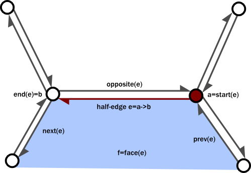

-parent=debris-opening-the-box
-title=Half-edges redux
-time=2012-04-03 08:03:22

Here it is, the conclusion to my half\-edge based mesh generator miniseries \(the data structure part, at least\). The first two parts covered the data structures used in GenMesh, the "old" mesh generator. In this part, I'll be talking about GenMinMesh, the successor to GenMesh which \(as they name suggests\) was designed to be much more minimal and more suitable for 64ks. As described in the last post, GenMesh tries to build everything out of a small set of primitive operations. The advantage is that the actual data structure manipulation and its associated complexity is concentrated into a few functions. Most of the remaining code defers the data structure management to those few functions; what remains is code to set up and modify vertex positions and attributes \- the part that you'll find in any mesh generator. The problem is that anything that uses the mesh generator at all will end up referencing most of that basic functionality, even if you only ever use \(say\) one type of primitive. Not a big deal for .kkrieger \(which after all used most of the code we had at the time\) and Debris \(where we didn't care at the time\), but it was an issue for 64ks \(not that we seriously pursued any 64k projects after Candytron\). Also, GenMesh was fairly slow \(mostly because every operation looped over the whole mesh to keep things simple, which meant all the repeated\-extrusion stuff hurt on big meshes\) and it was painful to deal with operations that resulted in meshes that weren't necessarily 2\-manifold \(or had them as temporaries\).

Hence GenMinMesh. And to get it out of the way, GenMinMesh is *not* actually a half\-edge based mesh generator. It's organized around conventional face and vertex structures \(slightly more sophisticated than a plain index buffer, but not by much\), but knows how to produce half\-edge adjacency information for the operations that need it. The data structures are simpler, there's way less pointer chasing, it's easy to create a mesh, and there might even be unicorns and rainbows involved! \(Not really\). So let's get started.

### Back to the basics

We're going to sacrifice some flexibility and go to a structure with a maximum number of edges per face \- allowing us to make the core data structures a lot more straightforward:

```
static const int KMM_MAXUV = 2;   // max number of UVs per vertex
static const int KMM_MAXBONE = 4; // max bones per vertex
static const int KMM_MAXVERT = 8; // max vertices per face

struct GenMinVert                 // a vertex
{
  bool Select;                    // selected or not
  U8 BoneCount;                   // how many bones in use?
  U16 Temp;                       // mostly padding

  Vec3 Pos;
  Vec3 Normal;
  Vec3 Tangent;
  Vec2 UV[KMM_MAXUV];
  float Weight[KMM_MAXBONE];      // bone weights
  U16 Matrix[KMM_MAXBONE];        // bone matrix index
};

struct GenMinFace                 // a face
{
  bool Select;                    // selected or not
  U8 Count;                       // edge count
  U16 Material;                   // material index, 0=deleted

  Vec3 Normal;                    // face normal
  int Vertices[KMM_MAXVERT];      // vertex indices
  int Opposite[KMM_MAXVERT];      // adjacency - see below
};
```

Note that this time, the vertices don't just describe connectivity, they have payload; in fact, they're almost all payload. GenMesh was designed to support variable vertex formats. As a result, there's basically no geometric information in the vertex structure \- there are separate arrays for positions, normals, UV coordinates etc., all of which might are indexed by the vertex number. If the mesh needs a second UV set, allocate space for that array, otherwise it's just a null pointer. This was flexible, but we never really ended up using that many different vertex formats, so this time we just opted to go for a fixed fat vertex layout that had everything we might conceivably use. This might still get converted into different vertex formats later down in the pipeline \(where it's easy\), but the mesh processing code doesn't have to be aware of it.

Why a maximum of 8 vertices per face? Well, that number clearly has to be at least 3 \(triangles\), and since we still want Catmull\-Clark subdivision it should really be at least 4 \(besides, almost all our primitives are mostly made of quads\). What about larger faces? For a planar graph \(or any other graph with Euler characteristic 2, which happens to include all meshes isomorphic to a sphere, i.e. connected 2\-manifolds without holes\) where each vertex has a minimum degree of 3 \(i.e. it's not just made of lines\), a well\-known fact is that the average face must have less than 6 edges \(this can be derived from the Euler formula $$V - E + F = 2$$ with some algebra\), and it can't have less than 3. So if we make the limit 6 \(or higher\), we *know* that higher\-degree faces are going to be rare in any mesh we're likely to encounter \- we could either special\-case them or make sure they're never created in the first place. GenMinMesh opts for the latter, for simplicity \(the actual limit is 8 because, well, 6 isn't a power of 2...\).

### So where's the half\-edges?

One prominent thing I haven't mentioned so far is the half\-edges. Indeed, what I've described so far is a classic face\-vertex structure with no edge information at all. Don't worry, the connectivity information is still there, but it's a lot more implicit than in the previous two posts.

Remember that a half\-edge is a directed edge between two vertices that belongs to a single face. Now, in a face\-vertex structure, we store indices of all the vertices belonging to a single face, in order. The half\-edges making up a face are implied to be between subsequent vertices in that list. In fact, if we specify both a face and a position in the ordered vertex list, we can uniquely identify any given half\-edge: the pair `(face, slot)` denotes the half\-edge from `face.Vertices[slot]` to `face.Vertices[(slot + 1) % face.Count]` \(indices are taken mod face.Count to handle wrap\-around\). For convenience, let's use the fact that we limit our polygons to a maximum of 8 edges to pack that face/slot pair into a single integer: `e = face_id*8 + slot` \(the half\-edge ID\). Now, let's have a look at the half\-edge diagram from the first part one more time, and check how much of the connectivity information we have covered at this point:



* **e itself**: Check \- we can uniquely reference each half\-edge in the mesh.
* **start\(e\)**: Check \- this is just `face.Vertices[slot]` \(and as noted in the first part, we only need to store one of the two vertex indices for each half\-edge, so we're good\).
* **face\(e\)**: Check \- since e is just a face/slot pair, we again can recover this one easily.
* **next\(e\)**: We just need to move over to the next slot in the same face \- again, with wrap\-around. So `next(e) = next((face, slot)) = (face, slot+1 % face.Count).`
* **prev\(e\)**: This time we decrement instead of incrementing, but otherwise it's the same.
* **opposite\(e\)**: Aha, this one we don't have, and there's no fast \(i.e. non\-"search everything"\) way to recover it from just the face and vertex lists. And there's this ominous\-looking `Opposite` array in our face structure. The plot thickens.
* \(Not pictured\) **faceEdge\(f\)**: For a given face, it's trivial to name a half\-edge that belongs to it: `(f, 0)` \(slot 0 for the given face\) should do.

So as you can see, we already have most of the connectivity information we care about; all we need to do is to keep track of the opposite half\-edges explicitly, the rest we can just infer from the face\-vertex information. As described above, it's easy to pack a \(face, slot\) pair into a single integer, which are precisely the integers we store in the `Opposite` array. Note that, in a sense, this layout is dual to the data structure described in the previous part: there we stored opposite half\-edges together but needed explicit links for everything else, here it's precisely the other way round.

### Throw\-away connectivity

A problem with the standard half\-edge representation is that some basic operations \(the most notorious one would probably be adding a single triangle to a mesh\) end up being tricky with lots of different cases to consider. The nice thing about the face\-vertex structure described above is that faces are still easy to manipulate \(in particular, adding new faces is easy\). The problem is that operations such as adding a face in the middle of the face list \(or a vertex in the middle of a face\) will affect multiple edge IDs, effectively breaking existing links.

The way GenMinMesh resolves this \(and related\) problems is quite simple. `Opposite` information is not guaranteed to be current; operators might or might not update it. However, there is a single boolean for the whole mesh denoting whether connectivity information is current. All operations that break links clear this flag. Now, if an operation that needs full connectivity \(such as mesh extrusion\) gets an input mesh that's not up\-to\-date, connectivity information gets rebuilt \(this boils down to setting all `Opposite` links correctly\).

The assumption is that, when in doubt, the list of faces and the per\-face vertex lists are always right. To rebuild connectivity, we first build a list of all half\-edges in the mesh in a temporary array. We want to match up opposite pairs; to make this work, we store not just the corresponding half\-edge ID but also the IDs of both vertices connected by the half edge, and \(arbitrarily\) define that the first vertex has to have a lower ID than the second vertex. We then sort the whole list lexicographically by those vertex IDs \- any decent sorting algorithm will do. After the sorting process, opposite half\-edges will be adjacent in the list, which makes the process of pairing up neighbors straightforward. In pseudocode: \(a bit Python\-y this time because my usual C\-like pseudocode is poorly suited to express data structure iteration concisely\)

```
half_edges = []
for face in (mesh.faces) {
    for e in (face.half_edges) {
        half_edges.add(edge_desc(id=e.id,
                         v0=min(start(e), end(e)),
                         v1=max(start(e), end(e))))
    }
}
half_edges.sort(keys=v0, v1)

for i in (1..len(half_edges)) {
    prev = half_edges[i-1]
    curr = half_edges[i]
    if (curr.v0 == prev.v0 && curr.v1 == prev.v1)
        connect_halfedges(prev.id, curr.id)
}
```

Regenerating connectivity information is thus about as expensive as sorting the list of half\-edges \- pretty cheap on current machines, on the kind of mesh sizes you're likely to use for real\-time rendering anyway. Now of course you could alternate between operations that destroy connectivity information and those that need connectivity information, meaning that this process gets repeated several times for a mesh. If that kind of thing is a serious concern, it's a better idea to just make sure the connectivity is up to date all the time \(i.e. use a regular half\-edge representation\). But in our case most operations are happy just messing around with the faces or vertices directly, and the simpler data structures greatly help to reduce code complexity and size. An extra advantage is that we don't have to strictly enforce 2\-manifoldness. We can represent meshes that aren't 2\-manifold just fine \(we just don't always answer connectivity queries correctly, but that's a lot better than rejecting them outright\), and it's also relatively easy to cope with boundaries: boundary edges are just edges that don't have any matching partner \- I use "\-1" as opposite half\-edge ID to encode this, which is the main reason for my edge IDs being signed.

### The discontinuities strike back

Looks pretty reasonable, right? There's just a small problem: As explained in the introduction, this time we're using "fat vertices", and there's no concept of crease edges, wedges or anything like that. It's just a list of vertices. And along a seam, we'll have one vertex one every side. Which means that the procedure above will produce disconnected islands with boundary edges on both sides \- definitely not what we want. So how do we fix it?

Again, the solution is low\-tech but and a bit limited but practical in the 64k context: we don't use "raw" vertex IDs when building connectivity information. Instead, we first do a small preprocess: we insert all vertices into a hash table, with the hash code being computed from the position \(no fancy geometric hashing \- this is using the raw bits\). All vertices that are at the exact same position should count as the same vertex for the purpose of generating connectivity. So we compute a simple array that is used to remap vertex IDs prior to building the half\-edge list above:

```
for v in (vertex_ids) {
    if (!hash_table.find(v.pos))
        hash_table[v.pos] = v.id
    remap[v.id] = hash_table[v.pos]
}

// now build "Opposite" array using remap[v.id]
// instead of raw v.id
```

The same trick can be used for other attributes, too. For example, there's usually the issue of smoothing groups: you want to assign smooth normals in smooth areas, but still be able to have a hard\-edged cube and things like that. If we don't do anything special, our current code will always err on the side of producing too many hard edges: whenever a vertex is duplicated, we will only incorporate normal information from the faces that directly reference it \- even if that vertex is just on an UV seam in a smooth area. But we can use the same "remap" idea here: this time, hash based on the original position and the original \(and now stale, but still present!\) vertex normal. Each vertex accumulates incident face normal information to \(and takes final vertex normal data from\) the remapped vertex.

Instead of explicitly keeping track of where discontinuities are supposed to go, as in the previous two articles, we just define a discontinuity for an attribute as "a place where there are currently two different values for the same attribute". If you want to add a discontinuity \- just add a new vertex in the same place and modify the attribute. Want to remove it? Simply make sure all vertices in that location have the same value for whatever attribute you're interested in, and the discontinuity's gone. Again, it's far more implicit than all the explicit bookkeeping we did last time, and it felt a bit weird when we first did it, coming from all the data structure overengineering that happened during GenMesh development \(I only described the end result, not the many weird intermediate stages\). But it's simple, it's not much code, and most importantly of all, *it's not in the way*. With GenMinMesh, if you want to generate a mesh, you just do it; there's no planning involved, and no tricky gymnastics to figure out how to most efficiently generate the topology.

### Conclusion

Okay, so in this miniseries, we saw two different mesh generators with two very different underlying data structures and philosophies, embodying opposite ends of the same spectrum. They're both valid, and both have their pros and cons \- and both, I think, are worth describing. In both cases, the design is constrained by the desire to keep the code small, which leads to some trade\-offs that make the code simpler but slower. In GenMinMesh, several operations that could easily generate `Opposite` information on the fly don't; the code to rebuild it is already going to be there \(since the input might have broken adjacency\), and rebuilding it is fast enough not to worry about it for the mesh sizes we actually use. Also, both generators have very simple selection mechanisms \(essentially a single bool per selectable element\) which are compact but lead to inefficient execution patterns, since every operation traverses the whole mesh, even if only 1 face or 5 vertices are selected.

This particular way of augmenting face\-vertex structures with adjacency information wasn't new when I originally implemented it for GenMinMesh, and it's certainly not now. [Directed Edges](http://citeseerx.ist.psu.edu/viewdoc/summary?doi=10.1.1.36.9701) describes a very similar data structure \(but aimed exclusively at triangle meshes\), and I remember seeing a version of that idea in [Pierre Terdiman's Mesh Consolidation code](http://codercorner.com/CodeArticles.htm) years ago, possibly before the "Directed Edges" paper was published. It's also used by the D3DXMesh code \(note all these variants deal with triangle meshes only, though\). Despite all this, the technique is not nearly as well\-known as it should be. I hope this article helps rectify that a bit.

If there's any bits that are either missing or weren't explained properly, feel free to comment. But unless there's major holes, I expect to close this topic now and move on to other stuff :\)
