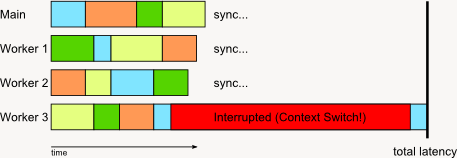

-title=Notes on caches and threads
-time=2011-02-26 11:45:31
This is a bit unsorted \- just a bunch of things I wanted to write down at some point but didn't feel like writing a full article about.

### Cache size is measured in lines, not bytes

This is important to keep in mind when thinking about cache utilization, particularly L1. For example, the Cell \(and also the Xbox 360 CPU\) has 32k of L1 data cache but 128\-byte cache lines, i.e. 256 cache lines total. Compare to e.g. the original 1993 Intel Pentium, which has 8k of L1 and 32\-byte cache lines, for a total of... 256 cache lines! If your data is laid out sequentially, you get to use the 4x increased capacity. But when you use linked data structures, you really don't: you're more likely than not to end up in a different cache line every time you dereference a pointer, so assuming each node fits into a cache line, you're limited to 256 nodes in your L1. Tops. Assuming no node straddles two cache lines and there are no set conflicts whatsoever.

32k of cache may sound like enough to keep your hot data structures in them \- but if you use linked data structures with small nodes, you only really get to use a fraction. Good thing to keep in mind.

### "Hardware thread" is an awful name

It just is. Overloading the term "thread" is a poor choice \- when talking among software people anyway. When talking about code running on chips with SMT \(Simultaneous multithreading, aka "HyperThreading" in Intel parlance\) there's instant confusion whenever the word "thread" is used, since it could either be a "software" \(OS\) thread or a hardware one.

Make up your own terminology, goddamnit! "Threads" \(like "Processes", "Fibers" and "Files"\) are a software concept \- an abstraction provided by the OS. A hardware thread isn't a thread at all; it's some extra infrastructure added to the hardware that is typically used by the OS to implement the "thread" abstraction. It deserves its own name.

That said, I don't have any brilliant suggestions either. The best I've come up with so far is "head", which is just a portmanteau of "Hardware thread" into a nice pronunciation\-friendly one\-syllable word. Pros are that it's from a semantic field not yet overused in programming \(body parts\), and it suggests a nice metaphor: imagine a hydra which has multiple heads but just one torso \- that's roughly how SMT processors work. Cons are that it's not really catchy and phonetically too similar to "thread". As said, it's not perfect. I'd be glad to hear better suggestions!

And while we're on the subject of terminology, I submit this for your consideration: Just continue the list from Fiber\-\>Thread naturally! A thread group is a "rope", and a group of ropes \(thread groups\) is a "dew". Yes, it's only half\-serious, but with the 3\-dimensional D3D11 compute shader "thread coordinates" it doesn't seem that silly anymore...

### Hardware threads compete for core resources!

Remember those 256 cache lines up there? Yeah, that's if you're only using one head. If you're using two, they're both running out of the same L1 cache, and neither will get all 256 lines \- with fun interference all around. The same goes for instruction cache, by the way. A great way to get 2\-way hardware multithreading except\-not\-really is by running 2 threads with code that branches around a lot. Pick your poison: use large unrolled functions with plenty of inlining and run out of L1 I\$ capacity, or use lots of small functions with tons of calls and end up using I\$ lines inefficiently \(and eating lots of branch penalties besides\). The only winning move is not to play that game in the first place. What you want is reasonably small, tight loops. *Especially* if you're using multiple HW threads \- since you usually also only get half the branch prediction slots, half the BTB entries, and so on.

Also note that extra heads really aren't like extra cores. If you have more cores, you can get substantial speedups even using algorithms that don't scale linearly \(i.e. more threads cause some amount of extra work\). With extra heads, that doesn't work, or at least doesn't work very well; if you're running into a bottleneck of the core \(be it computation, memory bandwidth, instruction decoding, or something else\), adding extra heads doesn't help \- they're meant to avoid stalls. If you're keeping the core busy as\-is, you need an extra head about as much as you... well, need a second head, actually. :\) And there's also the bit about the smaller effective data cache size and so on. Of course there's advantages too: heads on one core can share data much more efficiently than different cores can since they're using the same L1 cache, they have no coherency traffic between them, and they don't suffer from false sharing. So they're very well suited to low\-latency fine\-grained threading.

### Threads, threads, and threads

The concept of threads \(the software kind\) has been around for a while, but not all threads are created \(or should I say designed?\) equal. Threads are used for different reasons, and even some fit the underlying OS thread abstraction better than others.

The first major use case is different "subprograms" that execute concurrently from the user's point of view \- the OS might decide to put two threads onto different cores so they actually execute at the same time, or it might opt to multiplex both onto one core by time\-slicing. This is the "original" thread model; it's what you use to keep UI responsive even when the app is doing some intensive number crunching right now, etc. It's what OSes expect you to do when you create a thread.

The second case is where you want the different "subprograms", but not the concurrency. You use threads purely to have several execution contexts in your program, but they don't run simultaneously, and you "switch" from one to the other at set points \(by "starting" thread 2 and putting thread 1 to sleep by waiting on some event/condition variable\). Basically, all you want from threads is to have two separate stacks. This is effectively using OS facilities to implement coroutines in a language that doesn't have them. Of course, this is overkill \- threads are fairly heavyweight entities and they get scheduled; that's a big price to pay for what's effectively a stack\-switching mechanism. When OS developers saw people doing this, they introduced "Fibers" to fill the niche. These exist \(under different names\) in basically all modern OSes and allow you to have multiple stacks, program counters and hence flows of execution, but without preemption and most of the hidden costs involved in creating a thread.

The third case is threads you create exclusively for the purpose of getting concurrency, i.e. what's commonly called "worker threads". Unlike the first two groups, they typically all run the same code \(or at least the same main loop\). This *only* makes sense if you have multiple cores, or one core with SMT. If you have neither, cut out the middleman \- just process the work in your main thread! Anyway, this kind of thread has existed for a long time in the server and high\-performance computing world, but its appearance on the desktop is relatively recent. And it shows: OSes don't have really great support for this kind of thread yet. There's lot of support code and libraries, but worker threads aren't really first\-class citizens at the OS level yet.

There's two problems: First, the way this is currently done is by setting up a "thread pool". At startup time, you create some number of threads \(usually as many as the number of available "logical" processors minus 1 for the main thread\) to be worker threads. The threads all check if there's work queued up, execute it if available and go to sleep if there's nothing to do. This works fine if all threads actually get assigned to a different head, but it quickly starts to suck once there's other apps doing the same thing, especially if one or more of them mess around with thread or process affinities. The second, more serious problem affects latency\-critical applications, which on desktop OSes usually means soft real\-time apps like games or media players. Such programs usually work frame\-based, with one sync\-point per frame where results must be ready \(not necessarily results from a computation started this frame \- the process can be pipelined across more than one frame \- but the "one sync per frame" design is fairly common\). This design interacts really badly with OS context switches. Here's a simple example with 16 jobs distributed across 4 worker threads to illustrate the problem:

Worker 3 gets interrupted shortly after it grabs its fourth job, and before it finishes. At that point in time, there's three remaining tasks left, which the three other workers divide among each other. And then the task list is empty and everyone waits for Worker 3 to finish... and waits... and waits some more until Worker 3 finally gets re\-activated and finishes its job. Ouch \- it would've been *much* faster if Worker 3 had only processed 3 items then gone to sleep, with the remaining 3 threads dividing up 4 jobs.

It all depends on timing. If you have a system that's self\-balancing \(e.g. a "work stealing" type job manager\), you will avoid most of the extra cost when one of the workers is interrupted early in the frame: the remaining threads just crunch through the work alone while one thread stalls. But if the interruption is shortly before a sync point, you're just screwed no matter what you do.

This is really a scheduling problem. If you have a worker thread, it's great to interrupt them when they've just finished a job, and extremely bad to interrupt them just after they agreed to start work on a new one. Ideally, you'd have a semi\-cooperative multitasking system for worker threads; after every job \(or every 10 jobs or whatever, depending on granularity\), worker threads do a syscall that signals "if you want to do a context switch, now would be a good time". This is not the same as a "sleep"/"yield" type operation; we don't want to relinquish our time slice, just signal that now is a good time to schedule something different if the time is almost up! The scheduler in turn promises to *only* do context switches at these points, unless it hasn't seen one in some set time interval \(say 20ms or so\), after which the thread is up for regular preemption.

That's a quick patch, but really you want to make the OS to be aware of worker threads on a deep level, just as it "knows" Threads and Fibers right now. A static thread pool works fine if you have exclusive control of the system, but it's the wrong model for a desktop OS. If you have multiple apps each running their own thread pools, you don't want to multiplex them onto the available hardware threads; ideally you want to change the number of worker threads available to each app instead! But to do this properly, the OS needs to be aware of the distinction first.