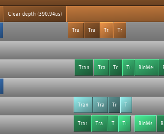
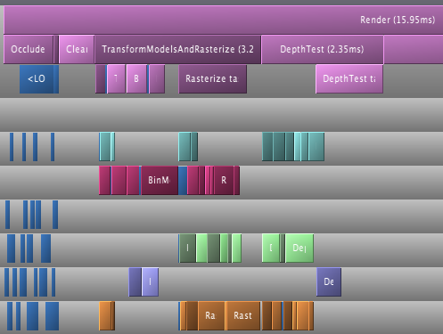
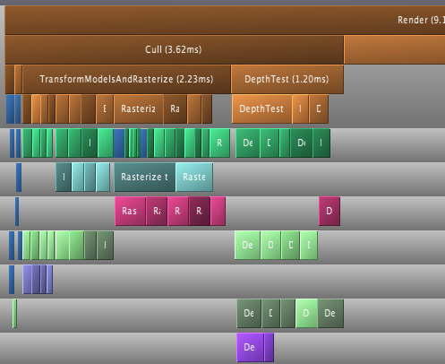

-parent=optimizing-sw-occlusion-culling-index
-title=The care and feeding of worker threads, part 2
-time=2013-02-25 10:39:45

In the [previous post](*care-and-feeding-of-worker-threads-part-1), we took a closer look at what our worker threads were doing and spent some time load\-balancing the depth buffer rasterizer to reduce our overall latency. This time, we'll have a closer look at the rest of the system.

### A bug

But first, it's time to look at a bug that I inadvertently introduced last time: If you tried running the code from last time, you might have noticed that toggling the "Multi Tasking" checkbox off and back on causes a one\-frame glitch. I introduced this bug in the changes corresponding to the section "Balancing act". Since I didn't get any comments or mails about it, it seems like I got away with it :\), but I wanted to rectify it here anyway.

The issue turned out to be that the `IsTooSmall` computation for occluders, which we moved from the "vertex transform" to the "frustum cull" pass last time, used stale information. The relevant piece of the main loop is this:

<pre>mpCamera-&gt;SetNearPlaneDistance(1.0f);
mpCamera-&gt;SetFarPlaneDistance(gFarClipDistance);
mpCamera-&gt;Update();

// If view frustum culling is enabled then determine which occluders
// and occludees are inside the view frustum and run the software
// occlusion culling on only the those models
if(mEnableFCulling)
{
    renderParams.mpCamera = mpCamera;
    mpDBR-&gt;IsVisible(mpCamera);
    mpAABB-&gt;IsInsideViewFrustum(mpCamera);
}

// if software occlusion culling is enabled
if(mEnableCulling)
{
    mpCamera-&gt;SetNearPlaneDistance(gFarClipDistance);
    mpCamera-&gt;SetFarPlaneDistance(1.0f);
    mpCamera-&gt;Update();

    // Set the camera transforms so that the occluders can
    // be transformed 
<span style="color:#c11;">    mpDBR-&gt;SetViewProj(mpCamera-&gt;GetViewMatrix(),
        (float4x4*)mpCamera-&gt;GetProjectionMatrix());</span>

    // (clear, render depth and perform occlusion test here)

    mpCamera-&gt;SetNearPlaneDistance(1.0f);
    mpCamera-&gt;SetFarPlaneDistance(gFarClipDistance);
    mpCamera-&gt;Update();
}
</pre>

Note how the call that actually updates the view\-projection matrix \(highlighted in red\) runs *after* the frustum\-culling pass. That's the bug I was running into. Fixing this bug is almost as simple as moving that call up \(to before the frustum culling pass\), but another wrinkle is that the depth\-buffer pass uses an inverted Z\-buffer with Z=0 at the *far* plane and Z=1 at the near plane \- note the calls that swap the positions of the camera "near" and "far" planes before depth buffer rendering, and the ones that swap it back after. There's [good reasons](http://www.humus.name/index.php?ID=255) for doing this, particularly if the depth buffer uses floats \(as it does in our implementation\). But to simplify matters here, I changed the code to do the swapping as part of the viewport transform instead, which means there's no need to be modifying the camera/projection setup during the frame at all. This keeps the code simpler and also makes it easy to move the `SetViewProj` call to before the frustum culling pass, where it should be now that we're using these matrices earlier.

### Some extra instrumentation

In some of the previous posts, we already looked at the frustum culling logic; this time, I also added another timer that measures our total culling time, including frustum culling and everything related to rendering the depth buffer and performing the bounding box occlusion tests. The code itself is straightforward; I just wanted to add another explicit counter so we can see the explicit summary statistics as we make changes. I'll use separate tables for the individual measurements:

<table>
  <tbody><tr>
    <th>Total cull time</th>
    <th>min</th><th>25th</th><th>med</th><th>75th</th><th>max</th><th>mean</th><th>sdev</th>
  </tr>
  <tr>
    <td>Initial</td>
    <td>3.767</td><td>3.882</td><td>3.959</td><td>4.304</td><td>5.075</td><td>4.074</td><td>0.235</td>
  </tr>
</tbody></table>

<table>
  <tbody><tr>
    <th>Render depth</th>
    <th>min</th><th>25th</th><th>med</th><th>75th</th><th>max</th><th>mean</th><th>sdev</th>
  </tr>
  <tr>
    <td>Initial</td>
    <td>2.098</td><td>2.119</td><td>2.132</td><td>2.146</td><td>2.212</td><td>2.136</td><td>0.022</td>
  </tr>
</tbody></table>

<table>
  <tbody><tr>
    <th>Depth test</th>
    <th>min</th><th>25th</th><th>med</th><th>75th</th><th>max</th><th>mean</th><th>sdev</th>
  </tr>
  <tr>
    <td>Initial</td>
    <td>1.249</td><td>1.366</td><td>1.422</td><td>1.475</td><td>1.656</td><td>1.425</td><td>0.081</td>
  </tr>
</tbody></table>

### Load balancing depth testing

Last time, we saw two fundamentally different ways to balance our multi\-threaded workloads. The first was to simply split the work into N contiguous chunks. As we saw for the "transform vertices" and "bin meshes" passes, this works great provided that the individual work items generate a roughly uniform amount of work. Since vertex transform and binning work were roughly proportional to the number of vertices and triangles respectively, this kind of split worked well once we made sure to split after early\-out processing.

In the second case, triangle rasterization, we couldn't change the work partition after the fact: each task corresponded to one tile, and if we started touching two tiles in one task, it just wouldn't work; there'd be race conditions. But at least we had a rough metric of how expensive each tile was going to be \- the number of triangles in the respective bins \- and we could use that to make sure that the "bulky" tiles would get processed first, to reduce the risk of picking up such a tile late and then having all other threads wait for its processing to finish.

Now, the depth tests are somewhat tricky, because neither of these strategies really apply. The cost of depth\-testing a bounding box has two components: first, there is a fixed overhead of just processing a box \(transforming its vertices and setting up the triangles\), and second, there's the actual rasterization with a cost that's roughly proportional to the size of the bounding box in pixels when projected to the screen. For small boxes, the constant overhead is the bigger issue; for larger boxes, the per\-pixel cost dominates. And at the point when we're partitioning the work items across threads, we don't know how big an area a box is going to cover on the screen, because we haven't transformed the vertices yet! But still, our depth test pass is in desperate need of some balancing \- here's a typical example:


There's nothing that's stopping us from treating the depth test pass the way we treat the regular triangle pass: chop it up into separate phases with explicit hand\-overs and balance them separately. But that's a really big and disruptive change, and it turns out we don't have to go that far to get a decent improvement.

The key realization is that the array of model bounding boxes we're traversing is not in a random order. Models that are near each other in the world also tend to be near each other in the array. Thus, when we just partition the list of world models into N separate contiguous chunks, they're not gonna have a similar amount of work for most viewpoints: some chunks are closer to the viewer than others, and those will contain bounding boxes that take up more area on the screen and hence be more expensive to process.

Well, that's easy enough to fix: *don't do that!* Suppose we had two worker threads. Our current approach would then correspond to splitting the world database in the middle, giving the first half to the first worker, and the second half to the second worker. This is bad whenever there's much more work in one of the halves, say because the camera happens to be in it and the models are just bigger on screen and take longer to depth\-test. But there's no need to split the world database like that! We can just as well split it non\-contiguously, say into one half with even indices and another half with odd indices. We can still get a lopsided distribution, but only if we happen to be a lot closer to all the even\-numbered models than we are to the odd\-numbered ones, and that's a lot less likely to happen by accident. Unless the meshes happen to form a grid or other regular structure that is, in which case you might still get screwed. :\)

Anyway, the same idea generalizes to N threads: instead of partitioning the models into odd and even halves, group all models which have the same index mod N. And in practice we don't want to interleave at the level of individual models, since them being close together also has an advantage: they tend to hit similar regions of the depth buffer, which have a good chance of being in the cache. So instead of interleaving at the level of individual models, we interleave groups of 64 \(arbitrary choice!\) models at a time; an idea similar to the disk striping used for RAIDs. It turns out to be a really easy change to make: just replace the original loop

```cpp
for(UINT i = start; i < end; i++)
{
    // process model i
}
```

with the only marginally more complicated

```cpp
static const UINT kChunkSize = 64;
for(UINT base = taskId*kChunkSize; base < mNumModels;
        base += mNumDepthTestTasks * kChunkSize)
{
    UINT end = min(base + kChunkSize, mNumModels);
    for(UINT i = base; i < end; i++)
    {
        // process model i
    }
}
```

and we're done. Let's see the change:

**Change:** "Striping" to load\-balance depth test threads.
<br><table>
  <tbody><tr>
    <th>Depth test</th>
    <th>min</th><th>25th</th><th>med</th><th>75th</th><th>max</th><th>mean</th><th>sdev</th>
  </tr>
  <tr>
    <td>Initial</td>
    <td>1.249</td><td>1.366</td><td>1.422</td><td>1.475</td><td>1.656</td><td>1.425</td><td>0.081</td>
  </tr>
  <tr>
    <td>Striped</td>
    <td>1.109</td><td>1.152</td><td>1.166</td><td>1.182</td><td>1.240</td><td>1.167</td><td>0.022</td>
  </tr>
</tbody></table>

<table>
  <tbody><tr>
    <th>Total cull time</th>
    <th>min</th><th>25th</th><th>med</th><th>75th</th><th>max</th><th>mean</th><th>sdev</th>
  </tr>
  <tr>
    <td>Initial</td>
    <td>3.767</td><td>3.882</td><td>3.959</td><td>4.304</td><td>5.075</td><td>4.074</td><td>0.235</td>
  </tr>
  <tr>
    <td>Striped depth test</td>
    <td>3.646</td><td>3.769</td><td>3.847</td><td>3.926</td><td>4.818</td><td>3.877</td><td>0.160</td>
  </tr>
</tbody></table>

That's pretty good for just changing a few lines. Here's the corresponding Telemetry screenshot:


Not as neatly balanced as some of the other ones we've seen, but we successfully managed to break up some of the huge packets, so it's good enough for now.

### One bottleneck remaining

At this point, we're in pretty good shape as far as worker thread utilization is concerned, but there's one big serial chunk still remaining, right between frustum culling and vertex transformation:



Clearing the depth buffer. This is about 0.4ms, about a third of the time we spend depth testing, all tracing back to a single line in the code:

<pre>    // Clear the depth buffer
    mpCPURenderTargetPixels = (UINT*)mpCPUDepthBuf;
    <span style="color:#c11;">memset(mpCPURenderTargetPixels, 0, SCREENW * SCREENH * 4);</span>
</pre>

Luckily, this one's really easy to fix. We could try and turn this into another separate group of tasks, but there's no need: we already have a pass that chops up the screen into several smaller pieces, namely the actual rasterization which works one tile at a time. And neither the vertex transform nor the binner that run before it actually care about the contents of the depth buffer. So we just clear one tile at a time, from the rasterizer code. As a bonus, this means that the active tile gets "pre\-loaded" into the current core's L2 cache before we start rendering. I'm not going to bother walking through the code here \- it's simple enough \- but as usual, I'll give you the results:

**Change:** Clear depth buffer in rasterizer workers

<table>
  <tbody><tr>
    <th>Total cull time</th>
    <th>min</th><th>25th</th><th>med</th><th>75th</th><th>max</th><th>mean</th><th>sdev</th>
  </tr>
  <tr>
    <td>Initial</td>
    <td>3.767</td><td>3.882</td><td>3.959</td><td>4.304</td><td>5.075</td><td>4.074</td><td>0.235</td>
  </tr>
  <tr>
    <td>Striped depth test</td>
    <td>3.646</td><td>3.769</td><td>3.847</td><td>3.926</td><td>4.818</td><td>3.877</td><td>0.160</td>
  </tr>
  <tr>
    <td>Clear in rasterizer</td>
    <td>3.428</td><td>3.579</td><td>3.626</td><td>3.677</td><td>4.734</td><td>3.658</td><td>0.155</td>
  </tr>
</tbody></table>

<table>
  <tbody><tr>
    <th>Render depth</th>
    <th>min</th><th>25th</th><th>med</th><th>75th</th><th>max</th><th>mean</th><th>sdev</th>
  </tr>
  <tr>
    <td>Initial</td>
    <td>2.098</td><td>2.119</td><td>2.132</td><td>2.146</td><td>2.212</td><td>2.136</td><td>0.022</td>
  </tr>
  <tr>
    <td>Clear in rasterizer</td>
    <td>2.191</td><td>2.224</td><td>2.248</td><td>2.281</td><td>2.439</td><td>2.258</td><td>0.043</td>
  </tr>
</tbody></table>

So even though we take a bit of a hit in rasterization latency, we still get a very solid 0.2ms win in the total cull time. Again, a very good pay\-off considering the amount of work involved.

### Summary

A lot of the posts in this series so far either needed conceptual/algorithmic leaps or at least some detailed micro\-architectural profiling. But this post and the previous one did not. In fact, finding these problems took nothing but a timeline profiler, and none of the fixes were particularly complicated either. I used Telemetry because that's what I'm familiar with, but I didn't use any but its most basic features, and I'm sure you would've found the same problems with any other program of this type; I'm told Intel's GPA can do the same thing, but I haven't used it so far.

Just to drive this one home \- this is what we started with:



\(total cull time 7.36ms, for what it's worth\) and this is where we are now:



Note that the bottom one is *zoomed in by 2x* so you can read the labels! Compare the zone lengths where printed. Now, this is not a representative sample; I just grabbed an arbitrary frame from both sessions, so don't draw any conclusions from these two images alone, but it's still fairly impressive. I'm still not sure why TBB only seems to use some subset of its worker threads \- maybe there's some threshold before they wake up and our parallel code just doesn't run for long enough? \- but it should be fairly obvious that the overall packing is a lot better now.

Remember, people. This is *the same code*. I didn't change any of the algorithms nor their implementations in any substantial way. All I did was spend some time on their callers, improving the work granularity and scheduling. If you're using worker threads, this is absolutely something you need to have on your radar.

As usual, the code for this part is up on [Github](https://github.com/rygorous/intel_occlusion_cull/tree/blog), this time with a few bonus commits I'm going to discuss next time \(spoiler alert!\), when I take a closer look at the depth testing code and the binner. See you then!
